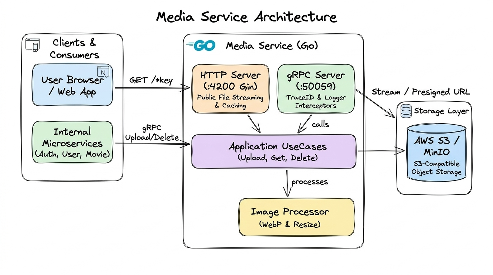

# 🍅 Tomato Cinema

<p align="center">
  
  
  
  
  
  
  
  
  
</p>

<p align="center">
  <b>Hệ thống xem phim và đặt vé trực tuyến kiến trúc Microservices phân tán với gRPC, Event-Driven RabbitMQ, Golang Media Engine, Next.js 16 và Monorepo.</b>
</p>

<p align="center">
  
  
  
  
  
  
</p>

---

## 📌 Tổng quan nền tảng

**Tomato Cinema** là nền tảng giải trí xem phim và đặt vé trực tuyến được xây dựng theo kiến trúc **Microservices phân tán thế hệ mới**. Hệ thống giải quyết các bài toán kỹ thuật phức tạp về hiệu năng, tính sẵn sàng và khả năng mở rộng thông qua:

- **Giao tiếp nhị phân nội bộ (Binary IPC):** Triển khai giao thức **gRPC trên nền HTTP/2** và **Protocol Buffers** cho toàn bộ tương tác giữa các dịch vụ, đạt độ trễ sub-millisecond và đảm bảo tính type-safe xuyên suốt đa ngôn ngữ.
- **Dịch vụ truyền thông hiệu năng cao (High-throughput Media Engine):** Microservice viết bằng **Golang 1.24** theo chuẩn **Clean Architecture**, tích hợp cơ chế **Streaming I/O (`io.Reader`)** với bộ lưu trữ tương thích chuẩn S3 (Cloudflare R2, MinIO) và chuyển đổi định dạng WebP tự động, không gây tràn RAM khi xử lý tệp tin lớn.
- **Kiến trúc hướng sự kiện (Event-Driven Architecture):** Sử dụng **RabbitMQ** phân phối bất đồng bộ các tác vụ nền (gửi mã OTP, thông báo hệ thống, Dead Letter Queue), giải phóng tài nguyên cho luồng request chính.
- **Cô lập cơ sở dữ liệu (Database-per-Service):** Mỗi dịch vụ quản lý cơ sở dữ liệu PostgreSQL độc lập (`auth_db`, `users_db`), bảo đảm tính toàn vẹn nghiệp vụ và độc lập triển khai.
- **Bảo mật đa tầng (Defense-in-Depth Identity):** Cơ chế xác thực Passwordless qua OTP Email, tích hợp SSO 1-chạm xác thực chữ ký mã hóa Telegram Bot (HMAC-SHA256), Refresh Token Rotation (RTR) trong HttpOnly Cookie và Redis Rate Limiting.
- **Giám sát phân tán (Full-stack Observability):** Tích hợp OpenTelemetry, Grafana Tempo (Distributed Tracing truyền `x-trace-id` xuyên gRPC & HTTP), Loki, Prometheus và Grafana.
- **Quản trị mã nguồn tập trung (Turborepo Monorepo):** Điều phối các gói dịch vụ qua **pnpm workspace** và **Go Workspace (`go.work`)** với pipeline build, lint và caching thông minh.

---

## 📑 Mục lục

- [1. Kiến trúc hệ thống & Sơ đồ trực quan](#1-kiến-trúc-hệ-thống--sơ-đồ-trực-quan)
  - [1.1. Kiến trúc phân tầng tổng thể](#11-kiến-trúc-phân-tầng-tổng-thể)
  - [1.2. Kiến trúc Clean Architecture của Media Service (Go)](#12-kiến-trúc-clean-architecture-của-media-service-go)
  - [1.3. Luồng xử lý dữ liệu truyền thông (Media Data Flow)](#13-luồng-xử-lý-dữ-liệu-truyền-thông-media-data-flow)
- [2. Cấu trúc Monorepo & Danh mục dịch vụ](#2-cấu-trúc-monorepo--danh-mục-dịch-vụ)
- [3. Bảng ma trận công nghệ](#3-bảng-ma-trận-công-nghệ)
- [4. Điểm nhấn kỹ thuật & Năng lực giải pháp](#4-điểm-nhấn-kỹ-thuật--năng-lực-giải-pháp)
- [5. Hướng dẫn thiết lập & Khởi chạy](#5-hướng-dẫn-thiết-lập--khởi-chạy)
  - [Bước 1: Chuẩn bị môi trường](#bước-1-chuẩn-bị-môi-trường)
  - [Bước 2: Cài đặt dependencies](#bước-2-cài-đặt-dependencies)
  - [Bước 3: Khởi động cụm hạ tầng (Postgres, Redis, RabbitMQ)](#bước-3-khởi-động-cụm-hạ-tầng-postgres-redis-rabbitmq)
  - [Bước 4: Cấu hình biến môi trường (.env)](#bước-4-cấu-hình-biến-môi-trường-env)
  - [Bước 5: Biên dịch Protobuf Contracts](#bước-5-biên-dịch-protobuf-contracts)
  - [Bước 6: Đồng bộ Schema Cơ sở dữ liệu](#bước-6-đồng-bộ-schema-cơ-sở-dữ-liệu)
  - [Bước 7: Vận hành hệ thống](#bước-7-vận-hành-hệ-thống)
  - [Bảng tra cứu cổng & địa chỉ truy cập](#bảng-tra-cứu-cổng--địa-chỉ-truy-cập)
- [6. Tự động hóa vận hành máy chủ (Homelab Operations)](#6-tự-động-hóa-vận-hành-máy-chủ-homelab-operations)
- [7. Giấy phép & Đóng góp](#7-giấy-phép--đóng-góp)

---

## 1. Kiến trúc hệ thống & Sơ đồ trực quan

### 1.1. Kiến trúc phân tầng tổng thể

Luồng xử lý từ Client qua tầng Reverse Proxy biên, API Gateway định tuyến gRPC, hàng đợi xử lý RabbitMQ và hệ thống lưu trữ phân tán:

<p align="center">
  
</p>

- **Client Tier:** Web Application (Next.js 16 + React 19) và Telegram Bot Client.
- **Edge Tier:** Nginx Reverse Proxy tiếp nhận lưu lượng, thiết lập SSL termination và phân vùng Rate Limiting.
- **Gateway Tier:** `gateway-service` tiếp nhận REST API, xác thực JWT Guard, chuyển dịch giao thức từ REST sang gRPC.
- **Service Tier (gRPC IPC):** `auth-service`, `user-service`, `media-service` trao đổi dữ liệu nội bộ qua HTTP/2 binary payload.
- **Event-Driven Tier:** `notification-service` lắng nghe các sự kiện AMQP từ RabbitMQ để phát tán OTP và email thông báo.
- **Storage Tier:** PostgreSQL (Auth DB, Users DB), Redis 8 (Sessions, Rate Limit, Token Blacklist), Cloudflare R2 / MinIO (S3-compatible Media Storage).

---

### 1.2. Kiến trúc Clean Architecture của Media Service (Go)

Phân tách độc lập các tầng: Domain Entities, Use Cases nghiệp vụ, Tầng giao diện kép (gRPC Server & Gin HTTP Server) và Tầng hạ tầng (S3 Storage Driver, WebP Image Processor):

<p align="center">
  
</p>

---

### 1.3. Luồng xử lý dữ liệu truyền thông (Media Data Flow)

Hỗ trợ 2 luồng xử lý chính: Luồng tải lên nội bộ qua gRPC (tối ưu nén ảnh WebP song song tải lên S3 Stream) và Luồng xem trực tiếp công khai qua HTTP Gin (nhận diện MIME type động, header Cache-Control 24h):

<p align="center">
  
</p>

---

## 2. Cấu trúc Monorepo & Danh mục dịch vụ

Hệ thống được tổ chức dạng **Turborepo Monorepo** với trình quản lý gói **pnpm workspace** và **Go Workspace (`go.work`)**:

```text
tomato_cinema/
├── apps/
│   ├── gateway-service/     # API Gateway: Tiếp nhận REST API, JWT Guard, Rate Limiting, Route gRPC
│   ├── auth-service/        # Identity Service: Passwordless OTP, Telegram SSO, Cấp phát & xoay JWT (Prisma)
│   ├── user-service/        # User Service: Quản lý hồ sơ cá nhân, phân quyền tài khoản (TypeORM)
│   ├── media-service/       # Media Engine (Go 1.24): Streaming I/O, S3/MinIO, WebP conversion, gRPC & Gin
│   ├── notification-service/# Worker xử lý thông báo: Lắng nghe RabbitMQ, gửi email OTP qua Mailer
│   ├── bot-service/         # Telegram Bot Service: Xử lý tương tác bot & xác thực SSO 1-chạm
│   ├── web/                 # Giao diện người dùng Web Client (Next.js 16 + React 19 + GSAP)
│   └── docs/                # Cổng tài liệu kỹ thuật & sơ đồ kiến trúc động (Fumadocs + Archify)
│
├── packages/
│   ├── contracts/           # Chứa file .proto và kịch bản biên dịch mã nguồn (ts-proto & protoc-gen-go)
│   ├── common/              # Module dùng chung: GrpcModule động, Custom Decorators, Filter, Interceptors
│   ├── passport/            # Chiến lược xác thực tập trung: Passport JWT Strategy & Guards dùng chung
│   ├── core/                # Data Transfer Objects (DTOs), Enums, kiểu dữ liệu chia sẻ toàn hệ thống
│   ├── ui/                  # Thư viện thành phần giao diện React chuẩn hóa (Radix UI + Tailwind CSS)
│   ├── eslint-config/       # Bộ quy tắc lint chuẩn mực áp dụng toàn bộ dự án
│   └── typescript-config/   # Cấu hình tsconfig nền tảng cho monorepo
│
├── docker/
│   ├── infra/               # Docker Compose cho PostgreSQL, Redis, RabbitMQ (+ Init DB Scripts)
│   ├── apps/                # Docker Compose chạy toàn bộ 6 microservices backend + Nginx
│   ├── nginx/               # Reverse Proxy & Edge Rate Limiter cấu hình Nginx
│   ├── observability/       # Cụm giám sát OpenTelemetry, Prometheus, Tempo, Loki, Grafana
│   ├── Dockerfile           # Multi-stage Dockerfile tối ưu dùng chung cho các service Node.js
│   └── media.Dockerfile     # Multi-stage Dockerfile + Distroless siêu nhẹ cho media-service
│
├── scripts/
│   └── homelab/             # Bộ script tự động hóa triển khai, đồng bộ và quản trị máy chủ qua Tailscale
│
├── turbo.json               # Pipeline build, dev và caching thông minh của Turborepo
├── package.json             # Root package scripts điều phối toàn bộ monorepo
├── pnpm-workspace.yaml      # Khai báo các workspaces thành viên
└── go.work                  # Go Workspace liên kết media-service và contracts Go package
```

---

## 3. Bảng ma trận công nghệ

| Lớp kiến trúc              | Công nghệ lựa chọn                     | Vai trò kỹ thuật & Cơ sở kiến trúc                                             |
| :------------------------- | :------------------------------------- | :----------------------------------------------------------------------------- |
| **Ngôn ngữ lập trình**     | TypeScript, Go (Golang 1.24)           | TypeScript Type-safe toàn diện; Golang cho tác vụ I/O media streaming siêu nhẹ |
| **Backend Framework**      | NestJS 11, Gin (Go)                    | NestJS module hóa enterprise; Gin HTTP server gọn nhẹ phục vụ media public     |
| **Giao thức nội bộ (IPC)** | gRPC, Protocol Buffers                 | Truyền tải nhị phân qua HTTP/2, chuẩn hóa hợp đồng dữ liệu, độ trễ cực thấp    |
| **Event Broker**           | RabbitMQ (AMQP)                        | Xử lý hàng đợi bất đồng bộ, gửi email OTP, tách tải khỏi main thread           |
| **Cơ sở dữ liệu**          | PostgreSQL 16                          | Database-per-Service: Tách biệt hoàn toàn `auth_db` và `users_db`              |
| **Bộ nhớ đệm & Phiên**     | Redis 8                                | Lưu trữ phiên, chống spam mã OTP, phân phối Rate Limiting                      |
| **Object Storage**         | S3-Compatible (Cloudflare R2 / MinIO)  | Lưu trữ posters, videos, avatars với cơ chế Streaming I/O không tốn RAM        |
| **ORM & Data Mapping**     | Prisma ORM, TypeORM                    | Prisma cho Auth (schema-first); TypeORM cho User (Data Mapper)                 |
| **Frontend Client**        | Next.js 16, React 19, Tailwind CSS     | Kiến trúc App Router, Server Components, dark cinematic theme                  |
| **Hiệu ứng & UI**          | GSAP (useGSAP), Radix UI               | Micro-interactions mượt mà, hỗ trợ prefers-reduced-motion                      |
| **Giám sát & Tracing**     | OpenTelemetry, Tempo, Loki, Prometheus | Phân tích Distributed Tracing nội bộ gRPC, tổng hợp Logs & Metrics             |
| **Build & Monorepo**       | Turborepo, pnpm workspaces, go.work    | Tối ưu thời gian build, chia sẻ hợp đồng proto, quản lý độc lập đa ngôn ngữ    |
| **Container & Proxy**      | Docker, Distroless, Nginx              | Đóng gói container đa tầng tối ưu dung lượng, Nginx Edge Rate Limiting         |

---

## 4. Điểm nhấn kỹ thuật & Năng lực giải pháp

Hệ thống được xây dựng với các giải pháp kỹ thuật tiêu chuẩn cao cho bài toán hệ thống phân tán:

- **Dynamic `GrpcModule` & Đóng gói `AbstractGrpcClient`:**
  - Tự thiết kế và đóng gói tầng Client gRPC chung trong `packages/common`, tự động chuyển đổi luồng dữ liệu `Observable` (RxJS) thành `Promise` native.
  - Viết code tại Controller/Service bằng cú pháp `async/await` rõ ràng, tự nhiên mà không cần viết boilerplate code lặp lại.
  - Đăng ký linh hoạt các package gRPC (`AUTH_PACKAGE`, `ACCOUNT_PACKAGE`, `USERS_PACKAGE`, `MEDIA_PACKAGE`) qua decorator tùy chỉnh `@InjectGrpcClient()`.

- **Media Engine viết bằng Golang với Streaming I/O:**
  - Tận dụng `io.Reader` và `io.ReadCloser` từ AWS SDK Go v2 để pipe trực tiếp luồng dữ liệu từ Object Storage tới người dùng, duy trì mức tiêu thụ RAM ổn định dưới 30MB ngay cả khi truyền tải tệp tin media dung lượng lớn.
  - Tích hợp pipeline chuyển đổi và nén ảnh sang định dạng WebP tự động, tiết kiệm 60–80% băng thông hiển thị cho web client.

- **Định danh hiện đại: Passwordless OTP & Telegram SSO:**
  - Quy trình xác thực không mật khẩu (Passwordless): Khách hàng nhập email ➔ Worker RabbitMQ xử lý gửi OTP ➔ Xác thực OTP an toàn qua Redis cache.
  - Hỗ trợ đăng nhập Telegram một chạm thông qua xác thực chữ ký mã hóa (HMAC-SHA256) từ Telegram Web App.
  - Cấp phát Access Token ngắn hạn và Refresh Token tự xoay vòng (Refresh Token Rotation) đặt trong cookie `HttpOnly, Secure, SameSite=Strict`, triệt tiêu nguy cơ tấn công XSS/CSRF.

- **Kiến trúc hướng sự kiện (Event-Driven) bền bỉ với RabbitMQ:**
  - Tách rời triệt để các tác vụ tốn tài nguyên (gửi email thông báo, phát mã OTP, ghi log sự kiện) ra khỏi vòng đời request chính của API Gateway.
  - Đảm bảo tính sẵn sàng cao, hỗ trợ cơ chế retry và Dead Letter Queue (DLQ) khi xảy ra sự cố xử lý.

- **Hợp đồng dữ liệu tập trung (Single Source of Truth Contracts):**
  - Quản lý toàn bộ định nghĩa giao tiếp giữa các service tại `packages/contracts` dưới dạng `.proto`.
  - Tự động biên dịch sinh mã TypeScript (`ts-proto`) và Go (`protoc-gen-go`) đồng bộ chỉ với 1 dòng lệnh, xóa bỏ hoàn toàn rủi ro sai lệch dữ liệu giữa các dịch vụ đa ngôn ngữ.

- **Phân tán vết (Distributed Tracing) xuyên suốt gRPC & HTTP:**
  - Tích hợp OpenTelemetry truyền `x-trace-id` xuyên qua các chặng mạng từ Nginx ➔ API Gateway ➔ Auth/User Service ➔ Media Service ➔ Grafana Tempo.
  - Giúp giám sát chi tiết luồng thực thi và xác định điểm nghẽn hiệu năng trên từng service độc lập.

---

## 5. Hướng dẫn thiết lập & Khởi chạy

### Bước 1: Chuẩn bị môi trường

- **Node.js**: Phiên bản 18 trở lên (Khuyên dùng **Node 20 LTS**).
- **pnpm**: Phiên bản 9 trở lên (`npm install -g pnpm`).
- **Docker & Docker Compose**: Để khởi chạy cụm hạ tầng cơ sở dữ liệu, cache và message broker.
- **Go** _(tùy chọn)_: Phiên bản 1.24 trở lên nếu muốn chạy `media-service` trực tiếp trên máy host.

---

### Bước 2: Cài đặt dependencies

```bash
# Clone repository
git clone https://github.com/kan-ckm/tomato_cinema.git
cd tomato_cinema

# Cài đặt toàn bộ dependencies trong monorepo
pnpm install
```

---

### Bước 3: Khởi động cụm hạ tầng (Postgres, Redis, RabbitMQ)

Cấu hình Docker Compose cho hạ tầng nằm tại `docker/infra/`:

```bash
cd docker/infra

# Tạo file .env hạ tầng từ mẫu
cp .env.example .env

# Khởi động PostgreSQL, Redis và RabbitMQ
docker compose up -d

# Kiểm tra trạng thái các container
docker compose ps

# Trở về thư mục gốc
cd ../..
```

> **Lưu ý:** Script khởi tạo `docker/infra/init-db/01-init-databases.sh` sẽ tự động tạo sẵn 2 cơ sở dữ liệu `auth` và `users` trong container PostgreSQL khi khởi tạo lần đầu.

---

### Bước 4: Cấu hình biến môi trường (`.env`)

Sinh nhanh các file `.env` từ file mẫu tại từng dịch vụ:

```bash
# 1. API Gateway
cp apps/gateway-service/.env.example apps/gateway-service/.env

# 2. Auth Service
cp apps/auth-service/.env.example apps/auth-service/.env

# 3. User Service
cp apps/user-service/.env.example apps/user-service/.env

# 4. Media Service
cp apps/media-service/.env.example apps/media-service/.env

# 5. Notification Service
cp apps/notification-service/.env.example apps/notification-service/.env

# 6. Telegram Bot Service
cp apps/bot-service/.env.example apps/bot-service/.env
```

_Cập nhật các tham số kết nối tương ứng (thông tin đăng nhập PostgreSQL, Redis, RabbitMQ, Token Telegram Bot, cấu hình SMTP mail)._

---

### Bước 5: Biên dịch Protobuf Contracts

Biên dịch các tệp `.proto` để sinh mã nguồn TypeScript và Go cho tất cả các dịch vụ:

```bash
pnpm --filter @tomatocinema/contracts build
```

---

### Bước 6: Đồng bộ Schema Cơ sở dữ liệu

Đồng bộ lược đồ cơ sở dữ liệu cho `auth-service` (Prisma ORM):

```bash
pnpm --filter auth-service exec prisma db push
```

_`user-service` sử dụng TypeORM và đã được cấu hình tự động đồng bộ thực thể (synchronize) trong môi trường phát triển._

---

### Bước 7: Vận hành hệ thống

#### 🟢 Chế độ 1: Hybrid Development (Khuyên dùng khi phát triển tính năng)

Hạ tầng (Postgres, Redis, RabbitMQ) chạy trên Docker, mã nguồn các services chạy trực tiếp trên máy host để kích hoạt Hot-Reload tức thì:

```bash
# Khởi động đồng thời tất cả ứng dụng Node.js (Gateway, Auth, User, Notification, Bot, Web, Docs)
pnpm dev
```

Khởi động **Media Service (Golang)**:

```bash
# Mở một terminal mới:
cd apps/media-service
go run cmd/main.go

# Hoặc khởi động với Air Live-Reload (nếu đã cài Air):
./scripts/run_dev.sh
```

Khởi động riêng lẻ từng dịch vụ khi cần:

```bash
pnpm --filter gateway-service dev    # API Gateway
pnpm --filter auth-service dev       # Auth Service
pnpm --filter user-service dev       # User Service
pnpm --filter web dev                # Web Client
```

---

#### 🐳 Chế độ 2: Full Containerized (Chạy toàn bộ qua Docker Compose)

Chạy kiểm thử toàn bộ hệ thống trong môi trường container khép kín:

```bash
cd docker

# Tạo các file .env tổng hợp
cp infra/.env.example infra/.env
cp apps/.env.example apps/.env

# Khởi động toàn bộ hệ sinh thái (Hạ tầng + 6 microservices + Nginx)
docker compose up -d --build
```

---

### Bảng tra cứu cổng & địa chỉ truy cập

| Dịch vụ / Công cụ        | Giao thức / Port | URL truy cập / Endpoint      | Mô tả chức năng                           |
| :----------------------- | :--------------- | :--------------------------- | :---------------------------------------- |
| **API Gateway**          | HTTP / `3000`    | `http://localhost:3000`      | Cổng tiếp nhận REST API chính             |
| **Swagger API Docs**     | HTTP / `3000`    | `http://localhost:3000/docs` | Tài liệu tương tác & kiểm thử trực tiếp   |
| **Web Client**           | HTTP / `3500`    | `http://localhost:3500`      | Giao diện xem phim Next.js 16             |
| **Documentation**        | HTTP / `3501`    | `http://localhost:3501`      | Cổng tài liệu kỹ thuật & sơ đồ tương tác  |
| **Media Service (HTTP)** | HTTP / `4200`    | `http://localhost:4200`      | Truyền phát và hiển thị hình ảnh media    |
| **Media Service (gRPC)** | gRPC / `50059`   | `localhost:50059`            | IPC tải lên / xóa tài nguyên media        |
| **Auth Service**         | gRPC / `50051`   | `localhost:50051`            | Dịch vụ xác thực và cấp phát JWT          |
| **User Service**         | gRPC / `50052`   | `localhost:50052`            | Dịch vụ quản lý hồ sơ và người dùng       |
| **RabbitMQ Dashboard**   | HTTP / `15673`   | `http://localhost:15673`     | Bảng điều khiển quản trị queue & exchange |
| **PostgreSQL**           | TCP / `5433`     | `localhost:5433`             | Cơ sở dữ liệu quan hệ (`auth`, `users`)   |
| **Redis**                | TCP / `6379`     | `localhost:6379`             | Bộ nhớ đệm phân tán và phiên làm việc     |

---

## 6. Tự động hóa vận hành máy chủ (Homelab Operations)

Dự án cung cấp bộ script tự động hóa triển khai trực tiếp lên cụm máy chủ **Homelab** qua mạng bảo mật ảo **Tailscale**:

```bash
# Đồng bộ mã nguồn lên Homelab qua rsync
pnpm homelab:sync

# Khởi động cụm Docker trên Homelab từ xa
pnpm homelab:up

# Xem log thời gian thực các container từ Homelab
pnpm homelab:logs

# Kiểm tra trạng thái sức khỏe container trên máy chủ
pnpm homelab:ps

# Dừng cụm dịch vụ Homelab
pnpm homelab:down
```

_Chi tiết cấu hình xem tại [`scripts/homelab/run.sh`](./scripts/homelab/run.sh)._

---

## 7. Giấy phép & Đóng góp

Dự án phát hành dưới giấy phép mã nguồn mở [MIT License](LICENSE).

Mọi đóng góp, báo lỗi hoặc yêu cầu tính năng mới đều được hoan nghênh thông qua **Issues** và **Pull Requests** trên GitHub repository.
