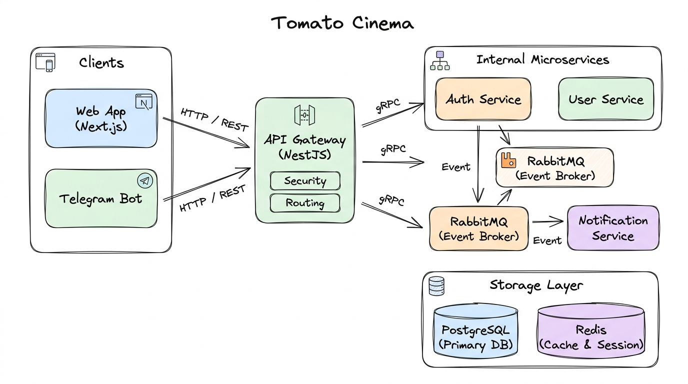
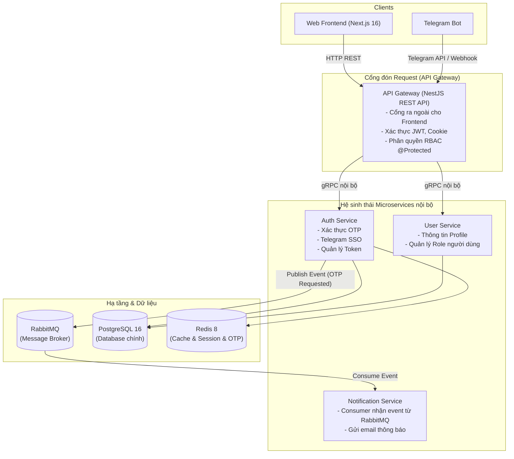

# 🍅 Tomato Cinema — Microservices Learning Project

<p align="center">
  
  
  
  
  
  
  
</p>

<p align="center">
  <b>Project cá nhân do tomato tự nghiên cứu và thực hành kiến trúc Microservices phân tán với gRPC, Event-Driven và Monorepo.</b>
</p>

<p align="center">
  
  
  
  
</p>

---

> [!NOTE]
> ### 🎓 LỜI MỞ ĐẦU & MỤC ĐÍCH DỰ ÁN
> Đây là **project cá nhân do một mình mình (tomato) tự tìm tòi, nghiên cứu và phát triển** — hoàn toàn **không có team hay tổ chức nào cả**. Mục đích duy nhất của dự án là để mình tự học hỏi, thử nghiệm thực tế cách thiết kế và vận hành một hệ sinh thái theo mô hình **Microservices phân tán** thay vì Monolith truyền thống.
> 
> 🚧 **Dự án vẫn đang trong quá trình phát triển (Work in Progress):**
> Vì là dự án làm một mình trong thời gian rảnh, toàn bộ từ kiến trúc backend, gRPC, event broker đến database đang được mình liên tục refactor, tối ưu hóa và bổ sung tính năng mới. Dự án chắc chắn sẽ còn nhiều điểm chưa hoàn hảo, rất hoan nghênh các anh/chị và các bạn đóng góp ý kiến để cùng nhau tiến bộ!


---

## 📌 Mục lục

- [1. Giới thiệu dự án & Mục tiêu học tập](#1-giới-thiệu-dự-án--mục-tiêu-học-tập)
- [2. Sơ đồ kiến trúc hệ thống](#2-sơ-đồ-kiến-trúc-hệ-thống)
- [3. Cấu trúc thư mục (Monorepo)](#3-cấu-trúc-thư-mục-monorepo)
- [4. Các công nghệ thực hành trong project](#4-các-công-nghệ-thực-hành-trong-project)
- [5. Hướng dẫn cài đặt và khởi chạy từ A - Z](#5-hướng-dẫn-cài-đặt-và-khởi-chạy-từ-a---z)
- [6. Những điểm thú vị đã làm được](#6-những-điểm-thú-vị-đã-làm-được)
- [7. Kế hoạch hoàn thiện tiếp theo (Roadmap)](#7-kế-hoạch-hoàn-thiện-tiếp-theo-roadmap)

---

## 1. Giới thiệu dự án & Mục tiêu học tập

Ý tưởng của dự án là mô phỏng lại một nền tảng xem phim trực tuyến (**Tomato Cinema**) nhưng được phân tách thành các dịch vụ độc lập để giải quyết các bài toán về:
- **Giao tiếp liên dịch vụ tốc độ cao:** Sử dụng **gRPC (HTTP/2 + Protocol Buffers)** thay vì REST HTTP/1.1 nội bộ để giảm payload và tối ưu độ trễ.
- **Xử lý tác vụ bất đồng bộ (Asynchronous Tasks):** Dùng **RabbitMQ** theo mô hình Event-Driven để xử lý các việc tốn thời gian (gửi mail OTP, thông báo) mà không làm nghẽn luồng xử lý chính của người dùng.
- **Tổ chức Monorepo quy mô lớn:** Sử dụng **Turborepo** và **pnpm workspace** để quản lý đa service, chia sẻ types, contracts và code logic dùng chung (`@tomatocinema/common`, `@tomatocinema/contracts`).
- **Bảo mật & Phiên làm việc:** Thực hành cơ chế xác thực không mật khẩu (Passwordless OTP), tích hợp đăng nhập qua Telegram SSO, quản lý Access/Refresh Token với kỹ thuật Refresh Token Rotation (lưu trong HttpOnly Cookie).

---

## 2. Sơ đồ kiến trúc hệ thống

<p align="center">
  
</p>

*Sơ đồ phác thảo trực quan kiến trúc phân tầng: **Clients** (Web / Bot) ➔ **API Gateway** (REST API) ➔ **Microservices** (gRPC nội bộ) ➔ **RabbitMQ** (Message Broker) & **Storage** (PostgreSQL, Redis).*

<details>
<summary><b>📐 Xem sơ đồ dạng mã nguồn Mermaid (Click để mở)</b></summary>



</details>

---

## 3. Cấu trúc thư mục (Monorepo)

Project được cấu trúc theo dạng Monorepo chuẩn:

```text
tomato_cinema/
├── apps/
│   ├── gateway-service/     # API Gateway chính: Đón HTTP từ Client, kiểm tra quyền, gọi gRPC nội bộ
│   ├── auth-service/        # Microservice định danh: Xử lý OTP, Telegram login, cấp & xoay token
│   ├── user-service/        # Microservice người dùng: Quản lý thông tin hồ sơ, cập nhật avatar/profile
│   ├── notification-service/# Worker lắng nghe RabbitMQ để gửi email OTP qua Mailer
│   ├── bot-service/         # Telegram Bot hỗ trợ luồng xác minh đăng nhập
│   ├── web/                 # Web client giao diện người dùng (Next.js 16 + React 19)
│   ├── docs/                # Trang tài liệu kỹ thuật của dự án
│   └── docker/              # File docker-compose.yml khởi chạy Postgres, Redis, RabbitMQ
│
├── packages/
│   ├── contracts/           # Hợp đồng chung: Chứa file .proto và sinh mã TypeScript (ts-proto)
│   ├── common/              # Thư viện dùng chung: GrpcModule động, factory, decorator, enum
│   ├── passport/            # Module cấu hình xác thực JWT Passport
│   ├── core/                # DTO, kiểu dữ liệu và định dạng chung
│   ├── ui/                  # Thư viện UI React dùng chung
│   ├── eslint-config/       # Cấu hình ESLint cho toàn bộ workspace
│   └── typescript-config/   # Cấu hình tsconfig dùng chung
│
├── turbo.json               # Cấu hình pipeline build & cache của Turborepo
├── package.json             # Root package script
└── pnpm-workspace.yaml      # Khai báo các gói trong monorepo
```

---

## 4. Các công nghệ thực hành trong project

| Mảng | Công nghệ sử dụng | Mục đích áp dụng |
| :--- | :--- | :--- |
| **Language** | TypeScript | Type-safe từ Frontend đến Backend và Database |
| **Backend** | NestJS 11 | Framework backend dạng module hóa, dễ dàng tích hợp gRPC và Microservices |
| **IPC (Liên service)** | gRPC, Protocol Buffers | Giao tiếp nội bộ cực nhanh, đảm bảo hợp đồng dữ liệu chuẩn xác |
| **Event Broker** | RabbitMQ | Xử lý hàng đợi phi đồng bộ, giảm tải cho request chính |
| **Database & Cache** | PostgreSQL 16, Redis 8 | Lưu trữ dữ liệu quan hệ kết hợp Redis lưu cache, session và chống spam OTP |
| **ORM** | Prisma, TypeORM | Thực hành cả 2 ORM phổ biến trong hệ sinh thái Node.js |
| **Frontend** | Next.js 16, React 19 | Thử nghiệm các tính năng mới nhất của React Server Components |
| **Monorepo Tool** | Turborepo, pnpm | Tối ưu hóa tốc độ build, chia sẻ code không cần publish lên npm |
| **DevOps cục bộ** | Docker, Docker Compose | Dựng môi trường database, message broker chỉ với 1 câu lệnh |

---

## 5. Hướng dẫn cài đặt và khởi chạy từ A - Z

Nếu bạn muốn clone project về máy để tham khảo hoặc chạy thử, hãy làm theo các bước dưới đây:

### Bước 1: Chuẩn bị môi trường
Máy bạn cần cài sẵn:
- **Node.js**: Phiên bản 18 trở lên (Khuyên dùng Node 20 LTS).
- **pnpm**: Phiên bản 9 trở lên (`npm install -g pnpm`).
- **Docker Desktop** (hoặc Docker Engine trên Linux): Dùng để chạy Postgres, Redis, RabbitMQ.

---

### Bước 2: Clone repository & Cài đặt thư viện
```bash
# Clone dự án về máy
git clone https://github.com/your-username/tomato_cinema.git
cd tomato_cinema

# Cài đặt tất cả dependencies cho các app và package trong monorepo
pnpm install
```

---

### Bước 3: Bật các dịch vụ hạ tầng với Docker
Project đã có sẵn cấu hình Docker Compose trong thư mục `apps/docker/`:

```bash
cd apps/docker

# Khởi động PostgreSQL, Redis và RabbitMQ chạy ngầm
docker compose up -d

# Quay lại thư mục gốc dự án
cd ../..
```

*Các cổng mặc định được mở trên máy host:*
- **PostgreSQL**: `localhost:5433`
- **Redis**: `localhost:6379`
- **RabbitMQ**: `localhost:5673` (AMQP) và `localhost:15673` (Dashboard quản trị)

---

### Bước 4: Cấu hình biến môi trường (`.env`)
Tạo file `.env` dựa theo các file `.env.example` tại từng thư mục service:
- `apps/gateway-service/.env`
- `apps/auth-service/.env`
- `apps/user-service/.env`
- `apps/notification-service/.env`
- `apps/bot-service/.env`

*Ví dụ cấu hình cơ bản cho API Gateway:*
```env
PORT=3000
NODE_ENV=development
COOKIE_DOMAIN=localhost
AUTH_GRPC_URL=localhost:50051
USERS_GRPC_URL=localhost:50052
```

---

### Bước 5: Biên dịch Protobuf Contracts (gRPC)
Trước khi chạy backend, các file `.proto` cần được biên dịch sang mã TypeScript:

```bash
pnpm --filter @tomatocinema/contracts build
```

---

### Bước 6: Đồng bộ Cơ sở dữ liệu (Database Migration)
Chạy migration cho cơ sở dữ liệu của `auth-service` (dùng Prisma):

```bash
pnpm --filter auth-service exec prisma db push
```

---

### Bước 7: Khởi động toàn bộ dự án
Nhờ có **Turborepo**, bạn chỉ cần 1 câu lệnh duy nhất tại thư mục gốc để khởi động tất cả các service cùng lúc:

```bash
pnpm dev
```

*Nếu bạn chỉ muốn chạy riêng một service cụ thể để kiểm tra:*
```bash
# Chỉ chạy Gateway:
pnpm --filter gateway-service dev

# Chỉ chạy Auth Service:
pnpm --filter auth-service dev

# Chỉ chạy User Service:
pnpm --filter user-service dev
```

Khi chạy thành công:
- **API Gateway (Swagger Docs):** Mở trình duyệt truy cập `http://localhost:3000/docs` để xem tài liệu API và test thử.
- **Web Frontend:** Truy cập `http://localhost:3500`.
- **RabbitMQ Management Dashboard:** Truy cập `http://localhost:15673`.

---

## 6. Những điểm thú vị đã làm được

- [x] **Tự xây dựng `AbstractGrpcClient`:** Đóng gói việc gọi gRPC, tự động chuyển `Observable` của RxJS thành `Promise`, giúp code ở Controller viết async/await cực kỳ tự nhiên.
- [x] **Xây dựng `GrpcModule` động dạng DynamicModule:** Đăng ký các client gRPC (`AUTH_PACKAGE`, `ACCOUNT_PACKAGE`, `USERS_PACKAGE`) thông qua factory tùy biến và decorator `@InjectGrpcClient()`.
- [x] **Luồng đăng nhập Passwordless an toàn:**
  - Nhập Email/SĐT -> Nhận mã OTP qua email (do Notification Service gửi qua RabbitMQ).
  - Xác thực OTP -> Cấp Access Token (lưu RAM) và Refresh Token (lưu HttpOnly Cookie bảo mật chống XSS).
- [x] **Đăng nhập Telegram một chạm:** Tích hợp Bot Telegram kiểm tra chữ ký dữ liệu để xác minh danh tính người dùng.
- [x] **Guard phân quyền linh hoạt:** Custom decorator `@Protected(RoleUser.ADMIN)` tự động kích hoạt cả kiểm tra đăng nhập (`AuthGuard`) và kiểm tra quyền (`RolesGuard`).

---

## 7. Kế hoạch hoàn thiện tiếp theo (Roadmap)

Dự án vẫn đang được mình tiếp tục hoàn thiện trong thời gian rảnh:

- [ ] **Catalog Service (Quản lý phim):**
  - [ ] CRUD danh mục phim, diễn viên, đạo diễn, thể loại.
  - [ ] Quản lý tập phim, mùa phim (Season & Episode).
- [ ] **Streaming Pipeline (Phát video):**
  - [ ] Tìm hiểu giải pháp chia đoạn video HLS (`.m3u8` / `.ts chunks`) để streaming mượt mà.
  - [ ] Phân quyền xem phim theo tài khoản miễn phí / VIP.
- [ ] **Frontend Web (Next.js 16):**
  - [ ] Hoàn thiện giao diện trang chủ, trang chi tiết phim và trình phát video.
  - [ ] Quản lý trạng thái đăng nhập và danh sách phim yêu thích.
- [ ] **Hạ tầng CI/CD:**
  - [ ] Thiết lập GitHub Actions tự động kiểm tra type và build test.
  - [ ] Viết Dockerfile tối ưu kích thước đa tầng (Multi-stage build) cho từng service.

---

## 👤 Tác giả

- **tomato** (Solo Developer)
- 📌 Đây là **dự án cá nhân độc lập**, không có bất kỳ team hay tổ chức nào tham gia cùng.

---

## 💬 Lời kết & Đóng góp

Dự án này là nơi mình tự ghi lại hành trình học hỏi về thiết kế hệ thống (System Design) và kiến trúc microservices thực chiến. Nếu bạn thấy project thú vị hoặc có bất kỳ góp ý, chia sẻ kinh nghiệm nào để hoàn thiện hơn, rất hoan nghênh bạn mở Issue hoặc Pull Request nhé!

Cảm ơn bạn đã ghé thăm repository! ⭐

