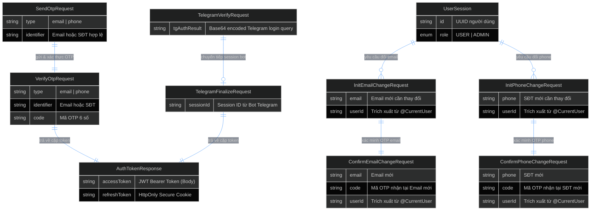
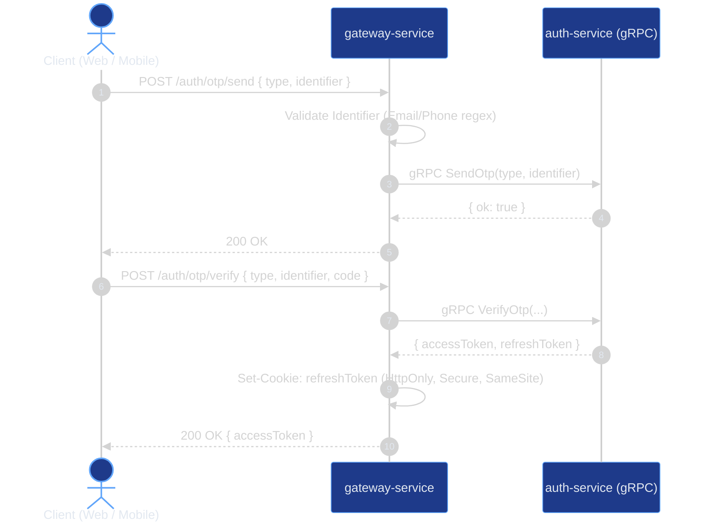
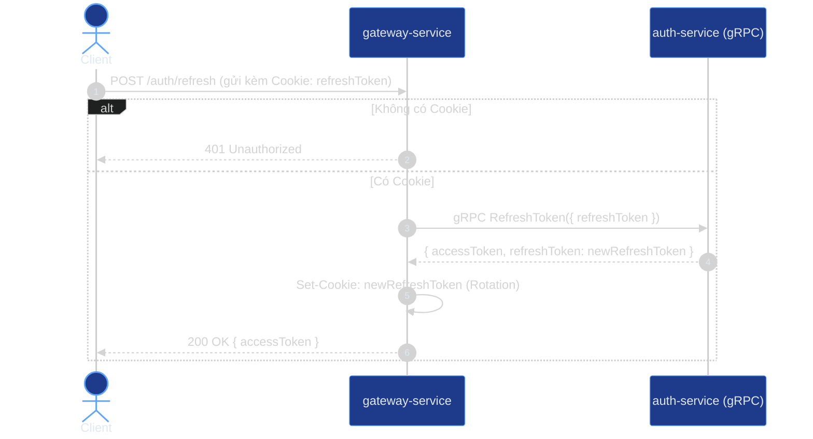
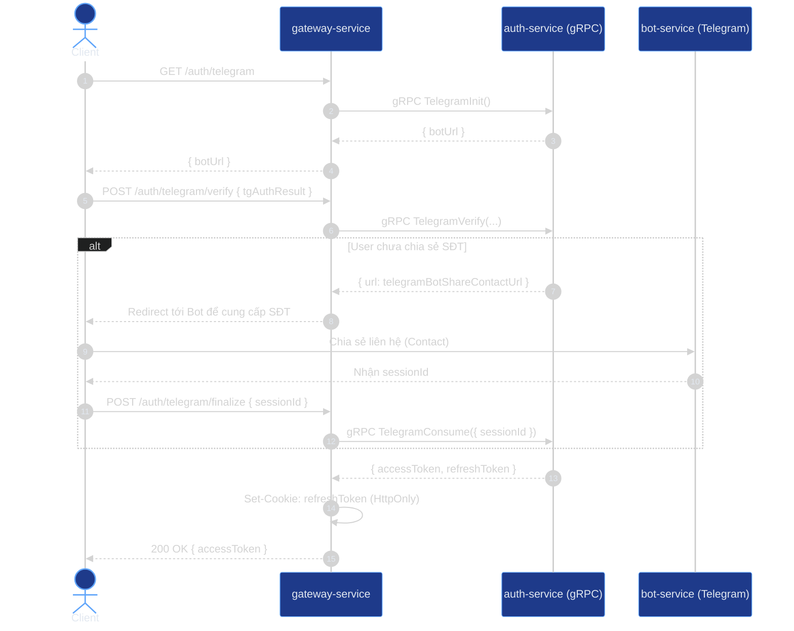
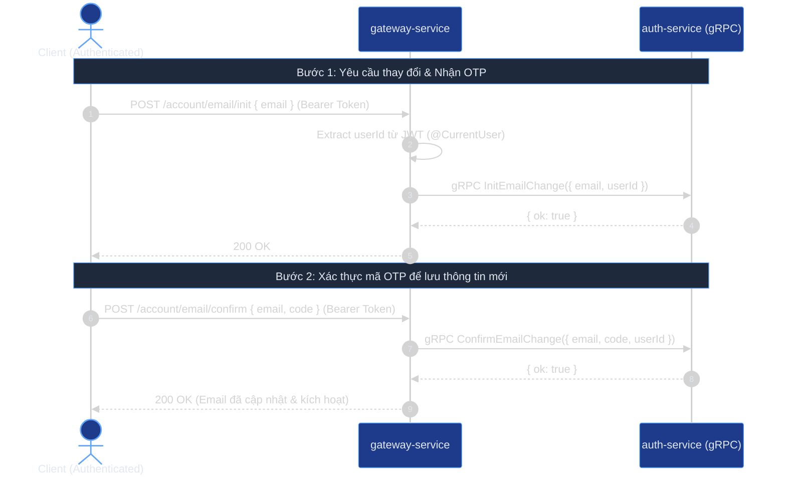

# 🌐 Gateway Service — Tomato Cinema API Gateway

API Gateway đóng vai trò là **Single Point of Entry (Cổng tiếp nhận duy nhất)** cho toàn bộ hệ thống **Tomato Cinema**. Service chịu trách nhiệm tiếp nhận HTTP REST requests từ Client (Web, Mobile, Telegram WebApp), thực thi xác thực JWT, kiểm tra tính hợp lệ của dữ liệu, quản lý session cookie an toàn và điều phối luồng xử lý tới các microservices nội bộ thông qua **gRPC**.

---

## 🏛️ Kiến trúc tổng thể (Gateway Architecture)

```mermaid
flowchart TD
    subgraph Clients["🌐 Client Layer"]
        Web["💻 Web App (Next.js)"]
        Mobile["📱 Mobile / Telegram WebApp"]
    end

    subgraph Gateway["🚪 gateway-service (Port: HTTP_PORT)"]
        direction TB
        CORS["CORS & Cookie Parser"]
        ValPipe["Validation Pipe (class-validator)"]
        AuthGuard["JWT AuthGuard & RolesGuard (@Protected)"]

        subgraph Controllers["Controllers"]
            AC["AuthController (/auth)"]
            ACC["AccountController (/account)"]
            HC["AppController (/health)"]
        end

        Filter["GrpcExceptionFilter (gRPC -> HTTP Status)"]

        CORS --> ValPipe --> AuthGuard --> Controllers
        Controllers -. Lỗi .- -> Filter
    end

    subgraph InternalServices["⚙️ Internal Microservices"]
        AuthSvc["🔐 auth-service (gRPC: auth.v1, account.v1)"]
    end

    Web -->|HTTP REST / Cookie| CORS
    Mobile -->|HTTP REST / Bearer Token| CORS
    AC -->|gRPC Unary Calls| AuthSvc
    ACC -->|gRPC Unary Calls| AuthSvc
    Filter -->|HTTP Error Response| Clients

    style Web fill:#2563eb,stroke:#3b82f6,color:#fff
    style Mobile fill:#2563eb,stroke:#3b82f6,color:#fff
    style CORS fill:#0284c7,stroke:#38bdf8,color:#fff
    style ValPipe fill:#0d9488,stroke:#14b8a6,color:#fff
    style AuthGuard fill:#7c3aed,stroke:#a855f7,color:#fff
    style AC fill:#0284c7,stroke:#38bdf8,color:#fff
    style ACC fill:#0284c7,stroke:#38bdf8,color:#fff
    style HC fill:#16a34a,stroke:#22c55e,color:#fff
    style Filter fill:#dc2626,stroke:#ef4444,color:#fff
    style AuthSvc fill:#1e3a8a,stroke:#3b82f6,color:#fff
```

---

## 📊 Mô hình dữ liệu & Quan hệ DTO (Entity / Contract Model)



---

## 🔄 Luồng tương tác chính (Sequence Diagrams)

### 1. Đăng nhập Passwordless bằng OTP (Email / SĐT)



### 2. Làm mới Token tự động (Refresh Token Rotation)



### 3. Đăng nhập Telegram OAuth / SSO



### 4. Thay đổi Email / Số điện thoại 2 bước



---

## 🛡️ Pipeline xử lý & Bảo mật (Middleware & Guards)

```mermaid
flowchart LR
    Req[Incoming HTTP Request] --> C[Cookie Parser]
    C --> V[ValidationPipe\nIdentifierValidator]
    V --> G{Cần Auth?}
    G -- Yes --> AG[AuthGuard\nVerify JWT]
    AG --> RG[RolesGuard\nCheck RoleUser]
    RG --> Ctrl[Controller Handler]
    G -- No --> Ctrl
    Ctrl --> Grpc[gRPC Call]
    Grpc --> Res[Response + Set-Cookie]

    style Req fill:#1e3a8a,stroke:#3b82f6,color:#fff
    style C fill:#0284c7,stroke:#38bdf8,color:#fff
    style V fill:#0d9488,stroke:#14b8a6,color:#fff
    style G fill:#d97706,stroke:#f59e0b,color:#fff
    style AG fill:#7c3aed,stroke:#a855f7,color:#fff
    style RG fill:#7c3aed,stroke:#a855f7,color:#fff
    style Ctrl fill:#0284c7,stroke:#38bdf8,color:#fff
    style Grpc fill:#1e3a8a,stroke:#3b82f6,color:#fff
    style Res fill:#16a34a,stroke:#22c55e,color:#fff
```



### Chi tiết bộ lọc lỗi gRPC (`GrpcExceptionFilter`)

| gRPC Status Code        | HTTP Status Code          | Ý nghĩa                                     |
| :---------------------- | :------------------------ | :------------------------------------------ |
| `OK (0)`                | `200 OK`                  | Xử lý thành công                            |
| `INVALID_ARGUMENT (3)`  | `400 Bad Request`         | Dữ liệu đầu vào sai định dạng               |
| `NOT_FOUND (5)`         | `404 Not Found`           | Không tìm thấy tài nguyên / OTP hết hạn     |
| `ALREADY_EXISTS (6)`    | `409 Conflict`            | Email / SĐT đã được sử dụng                 |
| `PERMISSION_DENIED (7)` | `403 Forbidden`           | Không đủ quyền thực hiện                    |
| `UNAUTHENTICATED (16)`  | `401 Unauthorized`        | Token không hợp lệ hoặc hết hạn             |
| `UNAVAILABLE (14)`      | `503 Service Unavailable` | Microservice nội bộ tạm thời không khả dụng |

---

## 🗺️ Danh sách API Endpoints

### 🔐 Module Authentication (`/auth`)

| Method | Endpoint                  | Bảo vệ |  Roles  | Mô tả                                                 | Payload / Params                                 |
| :----- | :------------------------ | :----: | :-----: | :---------------------------------------------------- | :----------------------------------------------- |
| `POST` | `/auth/otp/send`          |   ❌   |   All   | Gửi mã OTP qua Email hoặc SMS                         | `{ type: "email"\|"phone", identifier: string }` |
| `POST` | `/auth/otp/verify`        |   ❌   |   All   | Xác minh OTP, cấp Access Token & Cookie Refresh Token | `{ type, identifier, code }`                     |
| `POST` | `/auth/refresh`           |   ❌   |   All   | Cấp mới Access Token bằng Refresh Token trong Cookie  | Cookie: `refreshToken`                           |
| `POST` | `/auth/logout`            |   ❌   |   All   | Đăng xuất người dùng (xóa Cookie Refresh Token)       | Cookie: `refreshToken`                           |
| `GET`  | `/auth/account`           |   🔒   | `ADMIN` | Lấy ID người dùng từ Access Token                     | Header `Authorization: Bearer <token>`           |
| `GET`  | `/auth/telegram`          |   ❌   |   All   | Khởi tạo link đăng nhập Telegram Bot                  | Không                                            |
| `POST` | `/auth/telegram/verify`   |   ❌   |   All   | Xác thực chữ ký Telegram OAuth                        | `{ tgAuthResult: string }`                       |
| `POST` | `/auth/telegram/finalize` |   ❌   |   All   | Hoàn tất đăng nhập Telegram với session từ Bot        | `{ sessionId: string }`                          |

### 👤 Module Account (`/account`)

| Method | Endpoint                 | Bảo vệ |   Roles    | Mô tả                                     | Payload / Params                  |
| :----- | :----------------------- | :----: | :--------: | :---------------------------------------- | :-------------------------------- |
| `POST` | `/account/email/init`    |   🔒   | User/Admin | Gửi mã OTP xác nhận đến Email mới         | `{ email: string }`               |
| `POST` | `/account/email/confirm` |   🔒   | User/Admin | Xác minh OTP và cập nhật Email chính thức | `{ email: string, code: string }` |
| `POST` | `/account/phone/init`    |   🔒   | User/Admin | Gửi mã OTP xác nhận đến SĐT mới           | `{ phone: string }`               |
| `POST` | `/account/phone/confirm` |   🔒   | User/Admin | Xác minh OTP và cập nhật SĐT chính thức   | `{ phone: string, code: string }` |

### 🩺 Module Health (`/`)

| Method | Endpoint | Bảo vệ | Mô tả                                     | Response                              |
| :----- | :------- | :----: | :---------------------------------------- | :------------------------------------ |
| `GET`  | `/`      |   ❌   | Kiểm tra trạng thái hoạt động của Gateway | `{ status: "ok", timestamp: string }` |

---

## ⚙️ Biến môi trường (.env)

Tạo file `.env` từ `.env.example`:

```bash
cp .env.example .env
```

| Biến                  | Bắt buộc | Mặc định / Ví dụ             | Mô tả                                      |
| :-------------------- | :------: | :--------------------------- | :----------------------------------------- |
| `NODE_ENV`            |    Có    | `development` / `production` | Môi trường triển khai                      |
| `HTTP_PORT`           |    Có    | `3000`                       | Port lắng nghe của HTTP server             |
| `HTTP_HOST`           |    Có    | `http://localhost:3000`      | URL host công khai của Gateway             |
| `HTTP_CORS`           |    Có    | `http://localhost:3001`      | Origin được phép gọi CORS (Frontend)       |
| `COOKIE_SECRET`       |    Có    | `your-cookie-secret-key`     | Khóa bí mật dùng để ký và mã hóa cookie    |
| `COOKIE_DOMAIN`       |    Có    | `localhost`                  | Domain gán cho Refresh Token cookie        |
| `AUTH_GRPC_URL`       |    Có    | `localhost:50051`            | Địa chỉ gRPC server của **auth-service**   |
| `PASSPORT_SECRET_KEY` |    Có    | `your-jwt-secret-key`        | Secret key dùng để giải mã và xác thực JWT |

---

## 🚀 Cài đặt & Chạy Service

```bash
# 1. Cài đặt dependencies từ thư mục gốc monorepo
pnpm install

# 2. Chạy ở chế độ Development (Watch mode)
pnpm --filter gateway-service dev

# 3. Chạy ở chế độ Debug
pnpm --filter gateway-service debug

# 4. Build và Chạy Production
pnpm --filter gateway-service build
pnpm --filter gateway-service start:prod
```

---

## 📚 Swagger API Documentation

Sau khi khởi chạy service, truy cập giao diện Swagger UI tương tác trực tiếp tại:

```
http://localhost:<HTTP_PORT>/docs
```

- **OpenAPI Schema (YAML):** `http://localhost:<HTTP_PORT>/openapi.yaml`
