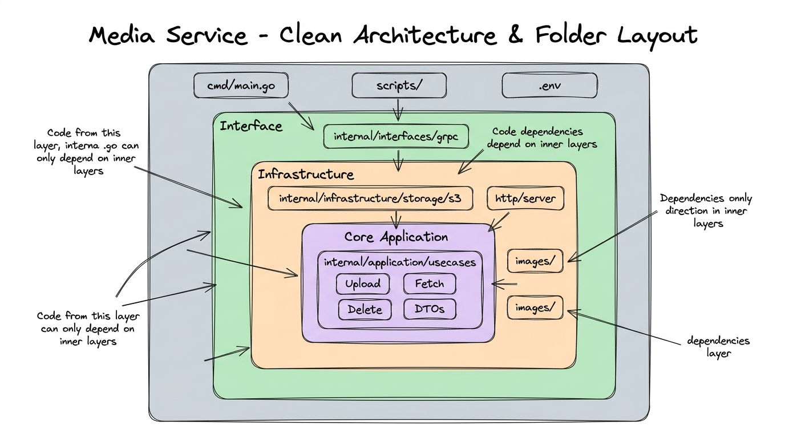
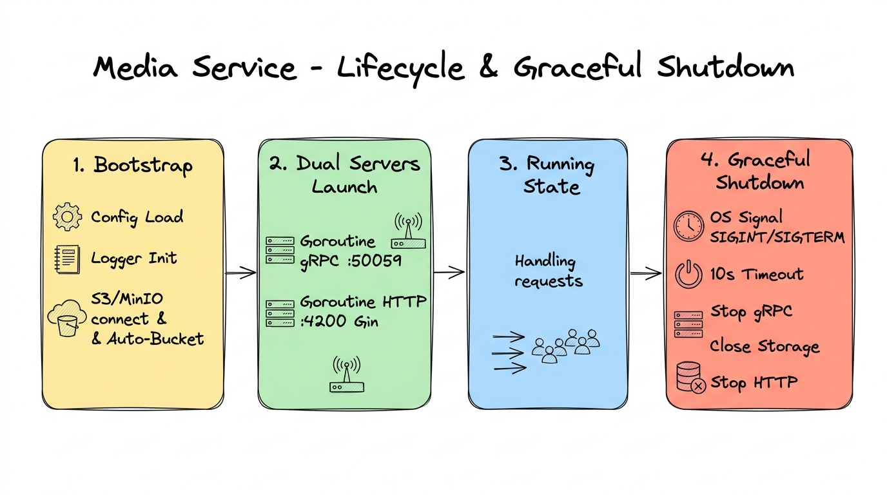

# 🎬 Hướng Dẫn Chi Tiết Dành Cho Lập Trình Viên Mới: `media-service`

Tài liệu này được biên soạn nhằm giúp các thành viên mới gia nhập dự án nắm bắt nhanh chóng **bối cảnh hệ thống**, **triết lý kiến trúc**, **cấu trúc thư mục** và **cách vận hành** của service `media-service` trong hệ sinh thái Tomato Cinema.

---

## 📑 Mục lục

1. [Giới thiệu & Vai trò của Media Service](#1-giới-thiệu--vai-trò-của-media-service)
2. [Kiến trúc tổng quan (Architecture Overview)](#2-kiến-trúc-tổng-quan-architecture-overview)
3. [Quy chuẩn phân tầng Clean Architecture & Bố trí thư mục](#3-quy-chuẩn-phân-tầng-clean-architecture--bố-trí-thư-mục)
4. [Giải phẫu chi tiết từng thành phần (Deep Dive)](#4-giải-phẫu-chi-tiết-từng-thành-phần-deep-dive)
   - [4.1. Điểm khởi chạy: `cmd/main.go`](#41-điểm-khởi-chạy-cmdmaingo)
   - [4.2. Cấu hình tập trung: `internal/config/`](#42-cấu-hình-tập-trung-internalconfig)
   - [4.3. Tầng nghiệp vụ: `internal/application/`](#43-tầng-nghiệp-vụ-internalapplication)
   - [4.4. Tầng tiếp nhận dữ liệu: `internal/interfaces/`](#44-tầng-tiếp-nhận-dữ-liệu-internalinterfaces)
   - [4.5. Tầng hạ tầng kỹ thuật: `internal/infrastructure/`](#45-tầng-hạ-tầng-kỹ-thuật-internalinfrastructure)
   - [4.6. Thư viện dùng chung & Scripts: `pkg/` & `scripts/`](#46-thư-viện-dùng-chung--scripts-pkg--scripts)
5. [Hai luồng dữ liệu cốt lõi (Data Flows)](#5-hai-luồng-dữ-liệu-cốt-lõi-data-flows)
6. [Vòng đời khởi chạy & Tắt an toàn (Graceful Shutdown)](#6-vòng-đời-khởi-chạy--tắt-an-toàn-graceful-shutdown)
7. [Hướng dẫn thiết lập & Chạy môi trường Local](#7-hướng-dẫn-thiết-lập--chạy-môi-trường-local)
8. [Các nguyên tắc lập trình quan trọng & Điểm phát triển tiếp theo](#8-các-nguyên-tắc-lập-trình-quan-trọng--điểm-phát-triển-tiếp-theo)

---

## 1. Giới thiệu & Vai trò của Media Service

`media-service` được viết bằng **Go (Golang 1.24)**, chịu trách nhiệm quản lý tập trung toàn bộ tài nguyên đa phương tiện (ảnh poster phim, banner rạp, avatar người dùng, tư liệu giới thiệu...) cho hệ sinh thái **Tomato Cinema**.

### Các công nghệ cốt lõi:

- **Ngôn ngữ:** Go (Golang) phiên bản 1.24+.
- **Giao tiếp nội bộ:** gRPC (`google.golang.org/grpc`) dựa trên protobuf `github.com/teacinema/contracts`.
- **Phục vụ người dùng:** Gin Web Framework (`github.com/gin-gonic/gin`).
- **Lưu trữ Object Storage:** AWS SDK for Go v2 (`github.com/aws/aws-sdk-go-v2`), tương thích hoàn toàn với AWS S3, MinIO và Cloudflare R2.
- **Xử lý luồng:** Cơ chế Non-buffering Streaming (`io.Reader` / `io.ReadCloser`) giúp tiết kiệm bộ nhớ RAM.

---

## 2. Kiến trúc tổng quan (Architecture Overview)

Dịch vụ áp dụng mô hình **giao thức kép (Dual-Protocol Server)**: một cổng gRPC nội bộ phục vụ việc ghi dữ liệu (Upload/Delete), và một cổng HTTP công khai phục vụ việc đọc dữ liệu (Streaming hình ảnh).

<p align="center">
  
</p>

- **Cổng gRPC (`:50059`)**: Nhận yêu cầu từ các microservice đồng cấp (như `movie-service`, `user-service`). Giao tiếp được tối ưu về tốc độ với Protobuf nhị phân và kèm theo bộ lọc Middleware (Logging, Distributed TraceID).
- **Cổng HTTP (`:4200`)**: Phục vụ trực tiếp cho Trình duyệt / Mobile App của người dùng cuối. Tự động nhận diện MIME type của file và gắn header HTTP Cache (`Cache-Control: public, max-age=86400`) để giảm tải cho máy chủ.
- **Tầng Storage trừu tượng**: Tách biệt logic nghiệp vụ khỏi công nghệ lưu trữ. Dù lưu trên MinIO Local hay AWS S3 Production, code nghiệp vụ hoàn toàn không thay đổi.

---

## 3. Quy chuẩn phân tầng Clean Architecture & Bố trí thư mục

Mã nguồn được tổ chức theo triết lý **Clean Architecture (Hexagonal / Ports & Adapters)**. Chiều phụ thuộc (Dependency Rule) luôn hướng từ ngoài vào trong:

<p align="center">
  
</p>

### Quy tắc định vị mã nguồn:

1. **Lớp ngoài cùng (Outer Layer)**: Chứa [`cmd/main.go`](file:///home/tomato/ssd/data/Projects/tomato_cinema_fork/apps/media-service/cmd/main.go), các file cấu hình môi trường [`.env.example`](file:///home/tomato/ssd/data/Projects/tomato_cinema_fork/apps/media-service/.env.example) và script chạy dev [`scripts/run_dev.sh`](file:///home/tomato/ssd/data/Projects/tomato_cinema_fork/apps/media-service/scripts/run_dev.sh). Lớp này có nhiệm vụ khởi động và ráp nối các thành phần với nhau.
2. **Lớp Giao diện (Interface / Inbound Adapters)**: Nằm tại [`internal/interfaces/grpc/`](file:///home/tomato/ssd/data/Projects/tomato_cinema_fork/apps/media-service/internal/interfaces/grpc/). Nhận request từ thế giới bên ngoài (Protobuf RPC), chuyển đổi sang DTO và gọi vào Use Case.
3. **Lớp Hạ tầng (Infrastructure / Outbound Adapters)**: Nằm tại [`internal/infrastructure/`](file:///home/tomato/ssd/data/Projects/tomato_cinema_fork/apps/media-service/internal/infrastructure/). Chứa triển khai chi tiết cho Storage (S3/MinIO), Image Processor, HTTP Server và gRPC Server.
4. **Lớp Nghiệp vụ cốt lõi (Core Application Layer)**: Nằm tại [`internal/application/`](file:///home/tomato/ssd/data/Projects/tomato_cinema_fork/apps/media-service/internal/application/). Chứa các Use Case độc lập (Upload, Get, Delete) và DTOs. Không phụ thuộc vào framework mạng hay thư viện bên thứ ba.

---

## 4. Giải phẫu chi tiết từng thành phần (Deep Dive)

### 4.1. Điểm khởi chạy: `cmd/main.go`

- **Vị trí file:** [`cmd/main.go`](file:///home/tomato/ssd/data/Projects/tomato_cinema_fork/apps/media-service/cmd/main.go)
- **Nhiệm vụ:**
  1. Gọi [`config.Load()`](file:///home/tomato/ssd/data/Projects/tomato_cinema_fork/apps/media-service/internal/config/config.go#L51) để tải biến môi trường.
  2. Khởi tạo logger qua [`logger.Init()`](file:///home/tomato/ssd/data/Projects/tomato_cinema_fork/apps/media-service/pkg/logger/logger.go#L13).
  3. Khởi tạo adapter lưu trữ [`storage.NewS3Storage(cfg)`](file:///home/tomato/ssd/data/Projects/tomato_cinema_fork/apps/media-service/internal/infrastructure/storage/s3.go#L35).
  4. Khởi tạo gRPC Server ([`grpc.NewServer`](file:///home/tomato/ssd/data/Projects/tomato_cinema_fork/apps/media-service/internal/infrastructure/grpc/server.go#L21)) và HTTP Server ([`httpserver.NewServer`](file:///home/tomato/ssd/data/Projects/tomato_cinema_fork/apps/media-service/internal/infrastructure/http/server.go#L29)).
  5. Dùng 2 Goroutine chạy song song cả 2 server:
     ```go
     go func() { grpcServer.Serve(grpcListener) }()
     go func() { httpSrv.Start() }()
     ```
  6. Kích hoạt hàm `waitForShutdown()` chờ tín hiệu OS để tắt dịch vụ an toàn.

---

### 4.2. Cấu hình tập trung: `internal/config/`

- **Vị trí file:** [`internal/config/config.go`](file:///home/tomato/ssd/data/Projects/tomato_cinema_fork/apps/media-service/internal/config/config.go)
- **Nhiệm vụ:** Ánh xạ các biến môi trường thành struct [`Config`](file:///home/tomato/ssd/data/Projects/tomato_cinema_fork/apps/media-service/internal/config/config.go#L9) có cấu trúc tường minh:
  - `App.Env`: Môi trường `development` hoặc `production`.
  - `HTTP.Port` / `HTTP.Host`: Cổng và domain sinh URL file tĩnh (`4200`, `localhost:4200`).
  - `GRPC.Port` / `GRPC.Host`: Cổng tiếp nhận RPC (`50059`, `localhost`).
  - `Storage`: Cấu hình S3/MinIO (`Driver`, `Bucket`, `Region`, `Endpoint`, `AccessKey`, `SecretKey`, `PublicURL`).
  - `Logging.Level`: Mức lọc log (`debug`, `info`, `warn`, `error`, `fatal`).

---

### 4.3. Tầng nghiệp vụ: `internal/application/`

#### DTOs (Data Transfer Objects)

- **Vị trí file:** [`internal/application/dto/media.go`](file:///home/tomato/ssd/data/Projects/tomato_cinema_fork/apps/media-service/internal/application/dto/media.go)
- **Nhiệm vụ:** Định nghĩa cấu trúc dữ liệu giao tiếp giữa Handler và Use Case:
  - [`UploadMediaRequest`](file:///home/tomato/ssd/data/Projects/tomato_cinema_fork/apps/media-service/internal/application/dto/media.go#L6): Chứa `FileName`, `Folder`, `ContentType`, `Size`, và quan trọng nhất là `Reader io.Reader` (dữ liệu dạng stream).
  - [`UploadMediaResponse`](file:///home/tomato/ssd/data/Projects/tomato_cinema_fork/apps/media-service/internal/application/dto/media.go#L18): Trả về `Key` (đường dẫn định danh file trên bucket).
  - [`GetMediaRequest`](file:///home/tomato/ssd/data/Projects/tomato_cinema_fork/apps/media-service/internal/application/dto/media.go#L23) / [`GetMediaResponse`](file:///home/tomato/ssd/data/Projects/tomato_cinema_fork/apps/media-service/internal/application/dto/media.go#L28): Trả về `Reader io.ReadCloser` và `ContentType`.
  - [`DeleteMediaRequest`](file:///home/tomato/ssd/data/Projects/tomato_cinema_fork/apps/media-service/internal/application/dto/media.go#L34) / [`DeleteMediaResponse`](file:///home/tomato/ssd/data/Projects/tomato_cinema_fork/apps/media-service/internal/application/dto/media.go#L39): Nhận `Key` cần xóa và trả về kết quả `OK`.

#### Use Cases

- **[`internal/application/usecases/upload.go`](file:///home/tomato/ssd/data/Projects/tomato_cinema_fork/apps/media-service/internal/application/usecases/upload.go)**:
  - [`UploadUseCase`](file:///home/tomato/ssd/data/Projects/tomato_cinema_fork/apps/media-service/internal/application/usecases/upload.go#L13): Tạo đường dẫn phân cấp `fmt.Sprintf("%s/%s", input.Folder, input.FileName)` và đẩy trực tiếp luồng stream vào adapter lưu trữ qua `storage.UploadStream`.
- **[`internal/application/usecases/fetch.go`](file:///home/tomato/ssd/data/Projects/tomato_cinema_fork/apps/media-service/internal/application/usecases/fetch.go)**:
  - [`GetUseCase`](file:///home/tomato/ssd/data/Projects/tomato_cinema_fork/apps/media-service/internal/application/usecases/fetch.go#L11): Nhận `Key`, yêu cầu storage trả về luồng `io.ReadCloser` và MIME type tương ứng.
- **[`internal/application/usecases/delete.go`](file:///home/tomato/ssd/data/Projects/tomato_cinema_fork/apps/media-service/internal/application/usecases/delete.go)**:
  - [`DeleteUseCase`](file:///home/tomato/ssd/data/Projects/tomato_cinema_fork/apps/media-service/internal/application/usecases/delete.go#L11): Thực hiện thao tác xóa tệp tin trên bucket bằng khóa `Key`.

---

### 4.4. Tầng tiếp nhận dữ liệu: `internal/interfaces/`

- **Vị trí file:** [`internal/interfaces/grpc/media_handler.go`](file:///home/tomato/ssd/data/Projects/tomato_cinema_fork/apps/media-service/internal/interfaces/grpc/media_handler.go)
- **Nhiệm vụ:**
  - Cài đặt struct [`MediaHandler`](file:///home/tomato/ssd/data/Projects/tomato_cinema_fork/apps/media-service/internal/interfaces/grpc/media_handler.go#L14) thỏa mãn interface sinh ra từ file protobuf `teacinema/contracts/gen/go/media`.
  - Phương thức [`Upload`](file:///home/tomato/ssd/data/Projects/tomato_cinema_fork/apps/media-service/internal/interfaces/grpc/media_handler.go#L38): Nhận `req.Data` ([]byte), đóng gói thành `bytes.NewReader(req.Data)` để thành `io.Reader`, sau đó chuyển giao cho [`UploadUseCase`](file:///home/tomato/ssd/data/Projects/tomato_cinema_fork/apps/media-service/internal/application/usecases/upload.go#L13).

---

### 4.5. Tầng hạ tầng kỹ thuật: `internal/infrastructure/`

#### 1. Lưu trữ Object Storage (`storage/`)

- **[`internal/infrastructure/storage/storage.go`](file:///home/tomato/ssd/data/Projects/tomato_cinema_fork/apps/media-service/internal/infrastructure/storage/storage.go)**: Interface [`Storage`](file:///home/tomato/ssd/data/Projects/tomato_cinema_fork/apps/media-service/internal/infrastructure/storage/storage.go#L17) định nghĩa các phương thức trừu tượng:
  ```go
  type Storage interface {
      UploadStream(ctx context.Context, key string, reader io.Reader, contentType string) error
      GetStream(ctx context.Context, key string) (io.ReadCloser, string, error)
      Delete(ctx context.Context, key string) error
      Close() error
  }
  ```
- **[`internal/infrastructure/storage/s3.go`](file:///home/tomato/ssd/data/Projects/tomato_cinema_fork/apps/media-service/internal/infrastructure/storage/s3.go)**:
  - Triển khai [`S3Storage`](file:///home/tomato/ssd/data/Projects/tomato_cinema_fork/apps/media-service/internal/infrastructure/storage/s3.go#L22) sử dụng AWS SDK v2.
  - Tự động bật `o.UsePathStyle = true` khi dùng MinIO.
  - Tự động kiểm tra (`HeadBucket`) và khởi tạo bucket mới (`CreateBucket`) nếu chưa tồn tại trong lúc boot service.
  - Hỗ trợ tạo liên kết tạm có chữ ký [`GetPresignedURL`](file:///home/tomato/ssd/data/Projects/tomato_cinema_fork/apps/media-service/internal/infrastructure/storage/s3.go#L161) cho phương thức `GET` và `PUT`.

#### 2. Xử lý tối ưu hình ảnh (`images/`)

- **[`internal/infrastructure/images/processor.go`](file:///home/tomato/ssd/data/Projects/tomato_cinema_fork/apps/media-service/internal/infrastructure/images/processor.go)**:
  - Định nghĩa interface [`Processor`](file:///home/tomato/ssd/data/Projects/tomato_cinema_fork/apps/media-service/internal/infrastructure/images/processor.go#L15) và cài đặt mặc định [`NoopProcessor`](file:///home/tomato/ssd/data/Projects/tomato_cinema_fork/apps/media-service/internal/infrastructure/images/processor.go#L21) (chuyển tiếp luồng ảnh gốc).
  - Đây là điểm mở rộng (extension point) để tích hợp nén WebP và resize tự động.

#### 3. Cấu hình gRPC & Middleware (`grpc/`)

- **[`internal/infrastructure/grpc/server.go`](file:///home/tomato/ssd/data/Projects/tomato_cinema_fork/apps/media-service/internal/infrastructure/grpc/server.go)**: Khởi tạo instance gRPC Server, đăng ký chuỗi Interceptor và khởi tạo các UseCases.
- **[`internal/infrastructure/grpc/interceptor.go`](file:///home/tomato/ssd/data/Projects/tomato_cinema_fork/apps/media-service/internal/infrastructure/grpc/interceptor.go)**:
  - [`RequestLoggerInterceptor`](file:///home/tomato/ssd/data/Projects/tomato_cinema_fork/apps/media-service/internal/infrastructure/grpc/interceptor.go#L16): Đo thời gian thực thi (latency) và in log trạng thái của mọi RPC call.
  - [`TraceIDInterceptor`](file:///home/tomato/ssd/data/Projects/tomato_cinema_fork/apps/media-service/internal/infrastructure/grpc/interceptor.go#L38): Đọc `x-trace-id` từ metadata hoặc tự sinh UUID mới gắn vào context, phục vụ Distributed Tracing.

#### 4. Phục vụ file qua HTTP Gin (`http/`)

- **[`internal/infrastructure/http/server.go`](file:///home/tomato/ssd/data/Projects/tomato_cinema_fork/apps/media-service/internal/infrastructure/http/server.go)**:
  - Khởi tạo Gin Web Server lắng nghe cổng `:4200`.
  - Route `GET /*key`: Mở stream từ S3 qua `GetStream`, nhận diện MIME bằng thư viện `mimetype.Detect()`, gắn header `Cache-Control: public, max-age=86400` và trả về nhị phân trực tiếp cho client.

---

### 4.6. Thư viện dùng chung & Scripts: `pkg/` & `scripts/`

- **[`pkg/logger/logger.go`](file:///home/tomato/ssd/data/Projects/tomato_cinema_fork/apps/media-service/pkg/logger/logger.go)**: Cung cấp các hàm in log tiện lợi (`Info`, `Warn`, `Error`, `Fatal`) có cơ chế kiểm tra level trước khi ghi.
- **[`scripts/run_dev.sh`](file:///home/tomato/ssd/data/Projects/tomato_cinema_fork/apps/media-service/scripts/run_dev.sh)**: Script nạp `.env` và kích hoạt tiện ích `air` để tự động biên dịch lại khi sửa code (live reload).
- **[`.air.toml`](file:///home/tomato/ssd/data/Projects/tomato_cinema_fork/apps/media-service/.air.toml)**: File cấu hình watcher cho `air`, chỉ định thư mục build `tmp/cmd.exe` và các phần mở rộng cần theo dõi (`.go`).

---

## 5. Hai luồng dữ liệu cốt lõi (Data Flows)

Dưới đây là chi tiết vòng đời của 2 thao tác quan trọng nhất trong dịch vụ:

<p align="center">
  
</p>

### 5.1. Luồng 1: Tải lên hình ảnh qua gRPC (Upload Flow)

1. Một microservice nội bộ (ví dụ `movie-service` khi tạo phim mới) gọi RPC `Upload(UploadRequest)` với dữ liệu nhị phân của ảnh poster.
2. `TraceIDInterceptor` gắn TraceID vào context; `RequestLoggerInterceptor` bắt đầu bấm giờ.
3. `MediaHandler.Upload()` bọc `req.Data` vào `bytes.NewReader` và chuyển tiếp sang [`UploadUseCase`](file:///home/tomato/ssd/data/Projects/tomato_cinema_fork/apps/media-service/internal/application/usecases/upload.go#L13).
4. [`UploadUseCase`](file:///home/tomato/ssd/data/Projects/tomato_cinema_fork/apps/media-service/internal/application/usecases/upload.go#L13) ghép tên tệp với thư mục (`posters/avatar-123.jpg`), đẩy qua bộ xử lý ảnh, rồi gọi `storage.UploadStream`.
5. [`S3Storage`](file:///home/tomato/ssd/data/Projects/tomato_cinema_fork/apps/media-service/internal/infrastructure/storage/s3.go#L22) đẩy stream thẳng lên S3/MinIO bucket bằng `uploader.Upload`.
6. Trả về `Key` cho `movie-service` lưu vào cơ sở dữ liệu.

### 5.2. Luồng 2: Phục vụ xem ảnh trực tiếp qua HTTP (Streaming Flow)

1. Trình duyệt hoặc Mobile App gửi `GET http://localhost:4200/posters/avatar-123.jpg`.
2. Gin HTTP Server tách lấy `key = "posters/avatar-123.jpg"`.
3. Server gọi `storage.GetStream(ctx, key)` để mở luồng đọc dữ liệu từ MinIO / S3.
4. Thư viện `mimetype.Detect` đọc header của stream để xác định chính xác kiểu nội dung (`image/jpeg`, `image/png`, `image/webp`).
5. Gắn header `Cache-Control: public, max-age=86400` (cache 24 giờ).
6. Trả dữ liệu ảnh trực tiếp về cho trình duyệt hiển thị.

---

## 6. Vòng đời khởi chạy & Tắt an toàn (Graceful Shutdown)

Hệ thống được thiết kế để đảm bảo không xảy ra hiện tượng ngắt kết nối đột ngột (connection drop) hay mất mát dữ liệu khi triển khai phiên bản mới:

<p align="center">
  
</p>

1. **Giai đoạn 1 (Bootstrap)**: Nạp cấu hình từ `.env` -> Cấu hình Logger -> Thiết lập kết nối S3/MinIO và tự động kiểm tra/tạo bucket.
2. **Giai đoạn 2 (Dual Servers Launch)**: Khởi chạy gRPC Server (`:50059`) và HTTP Server (`:4200`) trên các Goroutine độc lập.
3. **Giai đoạn 3 (Running State)**: Tiếp nhận các cuộc gọi upload từ microservices và streaming dữ liệu cho người dùng.
4. **Giai đoạn 4 (Graceful Shutdown)**:
   - Khi nhận tín hiệu `SIGINT` (Ctrl+C) hoặc `SIGTERM` (từ Docker/K8s).
   - Thiết lập thời gian chờ tối đa 10 giây (`context.WithTimeout(..., 10*time.Second)`).
   - Gọi `grpcServer.GracefulStop()` (dừng nhận RPC mới, đợi RPC cũ hoàn tất).
   - Gọi `mediaStorage.Close()` (đóng kết nối bộ lưu trữ).
   - Gọi `httpSrv.Stop(ctx)` (tắt HTTP server an toàn).

---

## 7. Hướng dẫn thiết lập & Chạy môi trường Local

### Bước 1: Yêu cầu môi trường

- Go phiên bản **1.24+**
- (Khuyên dùng) Cài đặt công cụ `air` để live reload:
  ```bash
  go install github.com/air-verse/air@latest
  ```
- Hệ thống Object Storage (MinIO local trên Docker hoặc tài khoản AWS S3).

### Bước 2: Tạo file `.env` từ file mẫu

Tại thư mục `apps/media-service`:

```bash
cp .env.example .env
```

Ví dụ cấu hình kết nối MinIO local:

```ini
APP_ENV='development'

# HTTP Server xem ảnh
HTTP_PORT=4200
HTTP_HOST='localhost:4200'

# gRPC Server
GRPC_PORT=50059
GRPC_HOST='localhost'

# MinIO Local Storage
S3_DRIVER='s3'
S3_BUCKET='tomato-cinema-media'
S3_REGION='us-east-1'
S3_ENDPOINT='http://localhost:9000'
S3_ACCESS_KEY='minioadmin'
S3_SECRET_KEY='minioadmin'

# Logger
LOG_LEVEL='debug'
```

### Bước 3: Tải thư viện & Chạy dịch vụ

```bash
# Tải các gói phụ thuộc
go mod download

# Chạy ở chế độ phát triển với live-reload:
./scripts/run_dev.sh

# Hoặc chạy trực tiếp qua Go:
go run cmd/main.go
```

Khi chạy thành công, console sẽ hiển thị:

```text
🚀 Đang khởi động media-service ở chế độ development
✅ Đã kết nối S3 bucket: tomato-cinema-media (vùng=us-east-1)
✅ Kết nối S3 storage thành công (bucket: tomato-cinema-media)
gRPC đang lắng nghe tại cổng :50059
HTTP đang lắng nghe tại cổng :4200
📦 Background queue workers đã sẵn sàng
```

---

## 8. Các nguyên tắc lập trình quan trọng & Điểm phát triển tiếp theo

> [!IMPORTANT]
> **1. Luôn sử dụng Stream I/O cho file Media:**
> Khi làm việc với các tầng UseCase và Storage, luôn truyền nhận qua `io.Reader` hoặc `io.ReadCloser`. Tránh đọc toàn bộ file video/ảnh dung lượng lớn vào mảng byte (`[]byte`) vì có thể gây tràn bộ nhớ RAM (OOM) khi lưu lượng truy cập cao.

> [!TIP]
> **2. Mở rộng Image Processor:**
> Hiện tại [`images.Processor`](file:///home/tomato/ssd/data/Projects/tomato_cinema_fork/apps/media-service/internal/infrastructure/images/processor.go#L15) đang dùng [`NoopProcessor`](file:///home/tomato/ssd/data/Projects/tomato_cinema_fork/apps/media-service/internal/infrastructure/images/processor.go#L21). Trong `go.mod` đã có sẵn thư viện `imaging` và `go-webp`. Bạn có thể hiện thực hóa logic tự động nén ảnh sang định dạng `.webp` trước khi lưu vào S3 để tối ưu dung lượng và băng thông.

> [!NOTE]
> **3. Bổ sung gRPC RPC `Get` và `Delete`:**
> Hai Use Case [`GetUseCase`](file:///home/tomato/ssd/data/Projects/tomato_cinema_fork/apps/media-service/internal/application/usecases/fetch.go#L11) và [`DeleteUseCase`](file:///home/tomato/ssd/data/Projects/tomato_cinema_fork/apps/media-service/internal/application/usecases/delete.go#L11) đã được xây dựng sẵn trong tầng Application. Khi cần tiếp nhận RPC xóa hoặc lấy metadata tệp qua gRPC, hãy đăng ký bổ sung method tương ứng vào [`MediaHandler`](file:///home/tomato/ssd/data/Projects/tomato_cinema_fork/apps/media-service/internal/interfaces/grpc/media_handler.go#L14).
