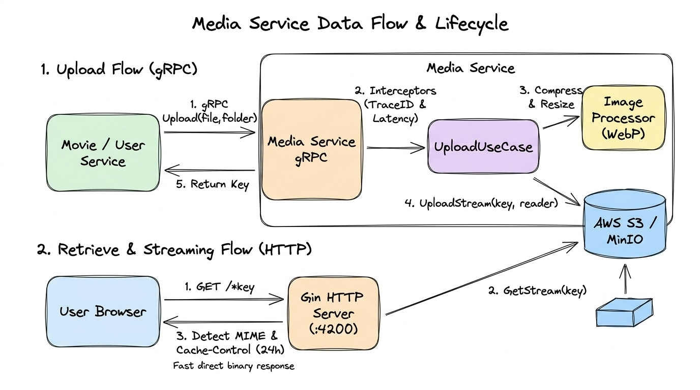

# 🎬 Tomato Cinema - Media Service

## 1. Tổng quan (Overview)

`media-service` là một microservice viết bằng **Go (Golang 1.24)** trong hệ sinh thái **Tomato Cinema**. Dịch vụ này đóng vai trò là **trung tâm quản lý tài nguyên đa phương tiện (Media Asset Management)**, chịu trách nhiệm lưu trữ, phục vụ và tối ưu hóa các tệp tin hình ảnh, video, poster phim, banner, avatar người dùng,...

### Đặc điểm nổi bật:

- **Ngôn ngữ & Hiệu năng cao:** Viết bằng Go, tận dụng tối đa xử lý I/O không đồng bộ và bộ nhớ nhẹ (lightweight footprint).
- **Kiến trúc kép (Dual Protocol):**
  - **gRPC Server (Port 50059):** Giao tiếp nội bộ giữa các microservices để tải lên (Upload), xóa (Delete), quản lý media.
  - **HTTP Server (Port 4200):** Cung cấp đường dẫn công khai (Public URL) phục vụ người dùng xem hình ảnh trực tiếp với cơ chế cache HTTP.
- **Tương thích chuẩn S3 (S3-Compatible Storage):** Tích hợp AWS SDK v2, hỗ trợ cả AWS S3, MinIO, Cloudflare R2 hoặc bất kỳ hệ thống lưu trữ tương thích S3 nào.
- **Cơ chế Streaming I/O:** Sử dụng `io.Reader` và `io.ReadCloser` để truyền tải dữ liệu, không tải toàn bộ file lớn vào bộ nhớ RAM.

---

## 2. Kiến trúc hệ thống (Architecture)

Dịch vụ được tổ chức theo mô hình **Clean Architecture / Hexagonal Architecture**, phân tách rõ ràng giữa tầng nghiệp vụ cốt lõi và các adapter kỹ thuật bên ngoài:

```
apps/media-service/
├── cmd/
│   └── main.go                     # Khởi tạo DI, chạy đồng thời gRPC & HTTP, xử lý Graceful Shutdown
├── internal/
│   ├── config/                     # Nạp biến môi trường từ .env
│   ├── application/                # Tầng nghiệp vụ (Use Cases & DTOs)
│   │   ├── dto/                    # Data Transfer Objects (Upload, Get, Delete)
│   │   └── usecases/               # UseCase: UploadMedia, GetMedia, DeleteMedia
│   ├── infrastructure/             # Tầng hạ tầng kỹ thuật
│   │   ├── grpc/                   # Cấu hình gRPC server & Interceptors (Logging, TraceID)
│   │   ├── http/                   # HTTP Server (Gin framework) phục vụ xem file
│   │   ├── images/                 # Module xử lý hình ảnh (Resize, WebP - Processor Interface)
│   │   └── storage/                # Storage Interface & Driver AWS S3 / MinIO
│   └── interfaces/                 # Tầng tiếp nhận dữ liệu (Adapters)
│       └── grpc/                   # gRPC Handlers tiếp nhận protobuf request
├── pkg/
│   └── logger/                     # Bộ ghi log nội bộ (Level: debug, info, warn, error, fatal)
└── scripts/
    └── run_dev.sh                  # Script chạy môi trường dev kết hợp live-reload (Air)
```

<p align="center">
  
</p>

_Sơ đồ kiến trúc trực quan Media Service theo phong cách nét vẽ (Hand-drawn sketchy style): Phân tầng giao thức kép (HTTP/Gin + gRPC), luồng xử lý Use Cases và tầng hạ tầng lưu trữ S3/MinIO._

---

### Sơ đồ luồng dữ liệu & Vòng đời xử lý (Data Flow & Lifecycle)

<p align="center">
  
</p>

_Chi tiết 2 luồng xử lý chính theo phong cách nét vẽ (Hand-drawn sketchy style): **Luồng 1 (gRPC Upload)** tối ưu nén WebP và lưu trữ S3 Stream; **Luồng 2 (HTTP Streaming)** phục vụ xem ảnh trực tiếp với nhận diện MIME động và Cache-Control 24h._

---

## 3. Các cổng giao tiếp & Giao thức (Protocols)

### 3.1. gRPC Server (`:50059`)

Được đăng ký thông qua `contracts` protobuf (`teacinema/contracts/gen/go/media`):

- **`Upload(UploadRequest) -> UploadResponse`**:
  - Nhận dữ liệu nhị phân (`Data`), tên file (`FileName`), thư mục phân loại (`Folder`), loại file (`ContentType`).
  - Trả về đường dẫn định danh `Key` (ví dụ: `posters/avatar-123.webp`).
- **Interceptors được tích hợp:**
  1. `RequestLoggerInterceptor`: Tự động đo và ghi nhận thời gian thực thi (latency) cho từng RPC call.
  2. `TraceIDInterceptor`: Đọc `x-trace-id` từ metadata hoặc tự động sinh UUID mới để gắn vào context.

### 3.2. HTTP Server (`:4200`)

Sử dụng **Gin framework** để phục vụ việc truy xuất dữ liệu tĩnh:

- **Endpoint:** `GET /*key`
- **Cơ chế xử lý:**
  1. Đọc stream từ S3 qua key truyền vào.
  2. Tự động nhận diện MIME type thực tế bằng thư viện `mimetype`.
  3. Gắn header `Cache-Control: public, max-age=86400` (cache 24 giờ trên trình duyệt/CDN).
  4. Trả về dữ liệu ảnh trực tiếp.

---

## 4. Cơ chế lưu trữ (Storage Layer)

Module lưu trữ nằm tại `internal/infrastructure/storage/`:

- **Interface `Storage`:** Thiết kế trừu tượng cho phép dễ dàng thay thế sang Local File System, Google Cloud Storage mà không ảnh hưởng tầng nghiệp vụ:
  ```go
  type Storage interface {
      UploadStream(ctx context.Context, key string, reader io.Reader, contentType string) error
      GetStream(ctx context.Context, key string) (io.ReadCloser, string, error)
      Delete(ctx context.Context, key string) error
      Close() error
  }
  ```
- **Triển khai `S3Storage`:**
  - Hỗ trợ **Path-Style Endpoint** (`o.UsePathStyle = true`), giúp tương thích 100% với MinIO chạy local trên Docker.
  - Tự động kiểm tra (`HeadBucket`) và khởi tạo Bucket (`CreateBucket`) khi dịch vụ khởi động nếu bucket chưa tồn tại.
  - Hỗ trợ tạo **Presigned URL** (`GetPresignedURL`) cho cả phương thức `GET` và `PUT`.

---

## 5. Cấu hình biến môi trường (Environment Variables)

Dịch vụ đọc cấu hình từ file `.env` (tham khảo [.env.example](file:///home/tomato/ssd/data/Projects/tomato_cinema_fork/apps/media-service/.env.example)):

| Biến môi trường | Mặc định         | Mô tả                                                           |
| --------------- | ---------------- | --------------------------------------------------------------- |
| `APP_ENV`       | `development`    | Môi trường chạy (`development` hoặc `production`)               |
| `HTTP_PORT`     | `4200`           | Cổng HTTP Server phục vụ file trực tiếp                         |
| `HTTP_HOST`     | `localhost:4200` | Hostname của HTTP Server để sinh public link                    |
| `GRPC_PORT`     | `50059`          | Cổng tiếp nhận các cuộc gọi gRPC nội bộ                         |
| `GRPC_HOST`     | `localhost`      | Hostname lắng nghe gRPC                                         |
| `S3_DRIVER`     | `s3`             | Trình điều khiển lưu trữ                                        |
| `S3_BUCKET`     | _(Bắt buộc)_     | Tên bucket (ví dụ: `tomato-cinema-media`)                       |
| `S3_REGION`     | `us-east-1`      | Khu vực S3                                                      |
| `S3_ENDPOINT`   | _(Tùy chọn)_     | Endpoint S3 tùy biến (ví dụ `http://minio:9000` khi dùng MinIO) |
| `S3_ACCESS_KEY` | _(Bắt buộc)_     | Access Key kết nối S3/MinIO                                     |
| `S3_SECRET_KEY` | _(Bắt buộc)_     | Secret Key kết nối S3/MinIO                                     |
| `S3_PUBLIC_URL` | _(Tùy chọn)_     | URL CDN hoặc Domain công khai của S3                            |
| `LOG_LEVEL`     | `debug`          | Mức độ ghi log (`debug`, `info`, `warn`, `error`, `fatal`)      |

---

## 6. Phân tích hiện trạng mã nguồn & Đánh giá (Current State Assessment)

### 6.1. Điểm mạnh (Strengths)

- **Kiến trúc chuẩn Clean Architecture:** Phân tách rõ ràng giữa DTO, UseCase, Storage Adapter và Handler.
- **Xử lý Stream tối ưu:** Upload và Download đều dùng `io.Reader`/`io.ReadCloser`, tránh tình trạng tràn RAM (Out of Memory) khi xử lý file media lớn.
- **Quản lý vòng đời tốt (Graceful Shutdown):** Bắt các tín hiệu `SIGINT` / `SIGTERM` và đóng an toàn cả gRPC server, HTTP server và Storage connection trong vòng 10 giây timeout.
- **Tương thích MinIO cao:** Code đã được viết sẵn cờ `UsePathStyle` và cơ chế auto-create bucket.

### 6.2. Các điểm đang hoàn thiện / Cần cải tiến (Gaps & Todo)

1. **Xử lý ảnh (Image Processor):**
   - Hiện tại mới chỉ là `NoopProcessor` (trả về luồng ảnh gốc, chưa thực sự resize hay nén).
   - Mặc dù file `go.mod` đã khai báo thư viện xử lý ảnh mạnh mẽ (`github.com/disintegration/imaging`, `github.com/kolesa-team/go-webp`), cần hoàn thiện logic chuyển đổi định dạng tự động sang **WebP** để tiết kiệm băng thông và tối ưu thời gian tải trang.
2. **Thiếu Handler gRPC cho `Get` và `Delete`:**
   - Trong `internal/interfaces/grpc/media_handler.go`, chỉ mới cài đặt phương thức `Upload`.
   - Tầng UseCase đã có sẵn `GetUseCase` và `DeleteUseCase`, cần đăng ký bổ sung các method tương ứng trong `MediaHandler`.
3. **Chưa có Dockerfile & tích hợp vào `docker-compose.yml`:**
   - Hiện tại `media-service` chưa có file `Dockerfile` riêng và chưa được khai báo trong `docker/apps/docker-compose.yml`.
4. **Chuẩn hóa Observability (Tracing & Logging):**
   - Dịch vụ đang dùng bộ ghi log dạng text đơn giản (`pkg/logger/logger.go`). Cần bổ sung xuất log JSON để tích hợp Promtail / Grafana Loki như các service khác trong hệ thống.
   - `TraceIDInterceptor` đang sinh ID thủ công, có thể tích hợp **OpenTelemetry Go SDK** (`go.opentelemetry.io/otel`) để bắn Trace về Jaeger / Tempo đồng bộ với `auth-service` và `gateway-service`.

---

## 7. Hướng dẫn chạy và phát triển (Development)

### Yêu cầu tiên quyết:

- Go phiên bản **1.24+**
- Hệ thống S3 (AWS S3 hoặc MinIO container đang hoạt động)

### Các lệnh thực thi:

```bash
# 1. Di chuyển vào thư mục media-service
cd apps/media-service

# 2. Cài đặt các thư viện Go
go mod download

# 3. Tạo file cấu hình từ file mẫu
cp .env.example .env

# 4. Chạy chế độ development (sử dụng script hoặc Air)
./scripts/run_dev.sh
# Hoặc chạy trực tiếp:
go run cmd/main.go
```
