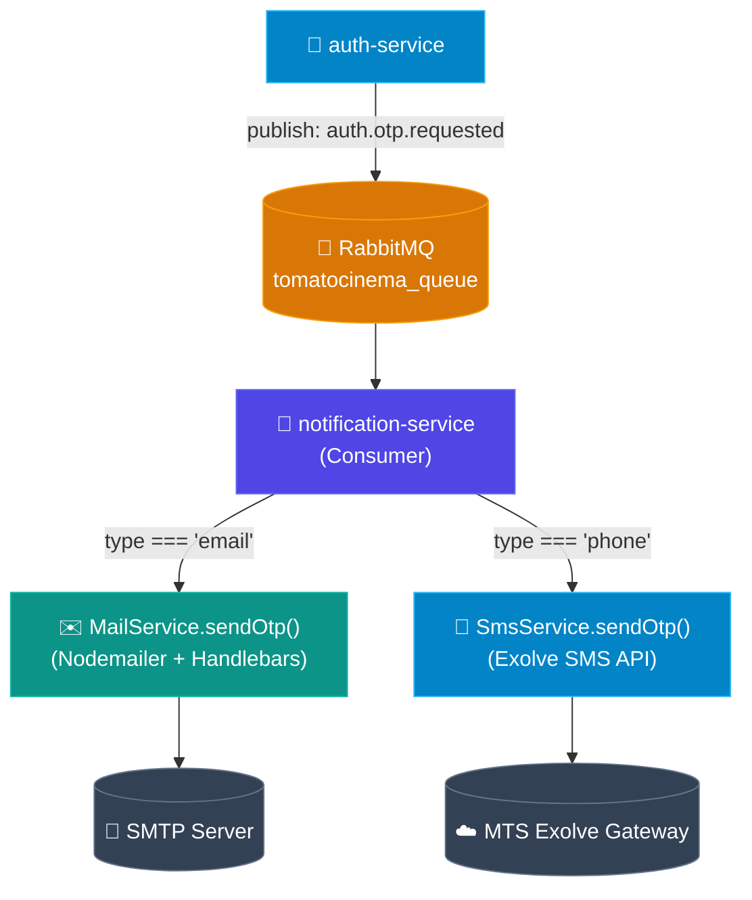

# notification-service

Microservice gửi thông báo cho hệ thống **Tomato Cinema** — xử lý gửi Email và SMS OTP.

## Chức năng

- Lắng nghe sự kiện từ **RabbitMQ** (ví dụ: `auth.otp.requested`)
- Gửi **Email OTP** qua SMTP với Handlebars template
- Gửi **SMS OTP** qua **Exolve API** (MTS)
- Cơ chế retry tự động khi gửi SMS thất bại (tối đa 3 lần)
- Structured logging với NestJS Logger

## Tech Stack

- **NestJS** — Framework chính
- **RabbitMQ (amqplib)** — Message consumer
- **Nodemailer + @nestjs-modules/mailer** — Gửi email
- **Handlebars** — Email template engine
- **Axios + @nestjs/axios** — Gọi Exolve SMS API
- **Zod** — Validate biến môi trường
- **`@tomatocinema/contracts`** — Shared event types

## Luồng xử lý OTP



## Cài đặt

```bash
cp .env.example .env
# Điền các giá trị vào .env
pnpm install
```

## Biến môi trường

| Biến                | Mô tả                                     |
| ------------------- | ----------------------------------------- |
| `NODE_ENV`          | Môi trường (`development` / `production`) |
| `RMQ_URL`           | RabbitMQ connection URL                   |
| `RMQ_QUEUE`         | Tên queue để lắng nghe                    |
| `SMTP_HOST`         | SMTP server host                          |
| `SMTP_PORT`         | SMTP server port                          |
| `SMTP_USERNAME`     | SMTP username                             |
| `SMTP_PASSWORD`     | SMTP password                             |
| `SMTP_FROM_ADDRESS` | Địa chỉ email gửi đi                      |
| `SMTP_SECURE`       | Sử dụng TLS (`true` / `false`)            |
| `EXOLVE_API_KEY`    | API key của Exolve (MTS)                  |
| `EXOLVE_SENDER`     | Số điện thoại / tên người gửi SMS         |

## Chạy service

```bash
# Development (watch mode)
pnpm dev

# Debug
pnpm debug

# Production
pnpm build && pnpm start:prod
```
