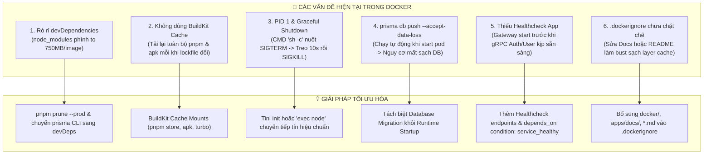

# Kế Hoạch Đánh Giá & Tối Ưu Hóa Toàn Diện Docker & Docker Images (Tomato Cinema)

## Goal Description

Đánh giá toàn diện hiện trạng cấu hình Dockerfile, kích thước Image, tốc độ build và Docker Compose trong toàn bộ dự án `tomato_cinema`. Từ các phát hiện thực tế (Image phình to 750MB - 1.22GB do rò rỉ `devDependencies`, thiếu BuildKit cache mounts, rủi ro mất dữ liệu với `db push --accept-data-loss`, thiếu graceful shutdown và container healthchecks), thiết lập kế hoạch tối ưu hóa chuẩn hóa đa tầng giúp:

1. **Giảm 50% - 70% kích thước image** (từ 1.22GB xuống ~250MB - 350MB uncompressed).
2. **Tăng tốc độ build từ 3x - 10x** nhờ BuildKit cache mounts (`pnpm store`, `apk cache`, `turbo cache`).
3. **Đảm bảo độ tin cậy và an toàn vận hành** (PID 1 graceful shutdown, loại bỏ rủi ro mất dữ liệu, bổ sung healthcheck và resource limits).

---

## Báo Cáo Đánh Giá Hiện Trạng Thực Tế

### 1. Bảng số liệu kích thước Image hiện tại

| Tên Image                                   | Kích thước Uncompressed | Kích thước Compressed | Mục tiêu sau tối ưu (Uncompressed) | Mức độ giảm |
| :------------------------------------------ | :---------------------: | :-------------------: | :--------------------------------: | :---------: |
| `tomato-cinema/auth-service:latest`         |       **1.22 GB**       |        252 MB         |        **~280 MB - 350 MB**        |  **~70%**   |
| `tomato-cinema/notification-service:latest` |       **865 MB**        |        167 MB         |        **~240 MB - 300 MB**        |  **~65%**   |
| `tomato-cinema/gateway-service:latest`      |       **815 MB**        |        159 MB         |        **~220 MB - 280 MB**        |  **~68%**   |
| `tomato-cinema/user-service:latest`         |       **752 MB**        |        148 MB         |        **~220 MB - 280 MB**        |  **~65%**   |
| `tomato-cinema/bot-service:latest`          |       **554 MB**        |        126 MB         |        **~180 MB - 220 MB**        |  **~60%**   |

_(Ghi chú: Dockerfile ghi chú kích thước ~150-240MB, nhưng thực tế khi giải nén chạy trên máy chủ là 750MB - 1.22GB)._

---

### 2. Các điểm tốt đã có (Strengths)

- ✅ Đã sử dụng kỹ thuật **Multi-Stage Build** (4 tầng: `base` -> `pruner` -> `builder` -> `runner`).
- ✅ Base image lựa chọn **Alpine Linux** (`node:22-alpine`) giúp giảm diện tích tấn công OS ban đầu.
- ✅ Sử dụng **Turborepo prune** (`turbo prune ${APP_NAME} --docker`) để chỉ lấy đúng source code của service mục tiêu.
- ✅ Áp dụng nguyên tắc **Least Privilege**: Chạy bằng non-root user `nestjs:nodejs` (UID 1001) trong Stage Runner.
- ✅ Cấu trúc Docker Compose phân tách module rõ ràng (`infra`, `apps`, `observability`) bằng cú pháp `include:` hiện đại của Docker Compose Spec.
- ✅ Cụm hạ tầng (`postgres`, `redis`, `rabbitmq`) có cấu hình healthcheck đầy đủ.

---

### 3. Các vấn đề cốt lõi cần giải quyết (Bottlenecks & Flaws)



1. **Rò rỉ toàn bộ `devDependencies` vào Production Image**:
   - Trong `docker/Dockerfile`, Stage 3 cài đặt toàn bộ dependencies (kể cả devDeps).
   - Khi chuyển sang Stage 4 runner, lệnh `COPY --from=builder /app/node_modules ./node_modules` sao chép nguyên vẹn 750MB thư mục `node_modules` chứa:
     - `@turbo/linux-64` (41.8 MB)
     - 3 phiên bản `typescript` (~70 MB)
     - `prettier` (18 MB)
     - `webpack` (7.6 MB)
     - `dprint-node` (23.6 MB)
     - `eslint`, `jest`, `supertest`, `caniuse-lite`, `fast-check`...
2. **Gói `prisma` CLI nằm nhầm trong `dependencies` của `auth-service`**:
   - `prisma` CLI trong `apps/auth-service/package.json` kéo theo `@prisma/studio-core` (42.2MB), `@electric-sql/pglite` (23.2MB), `@prisma/engines` (21.4MB) và cả `react-dom` vào container backend của `auth-service`.
3. **Thiếu BuildKit Cache Mounts**:
   - Lệnh `pnpm install` không mount cache: `RUN --mount=type=cache,id=pnpm,target=/pnpm/store pnpm install --frozen-lockfile`.
   - `apk add` không mount cache: `RUN --mount=type=cache,target=/var/cache/apk apk add ...`.
   - Không mount cache cho Turborepo (`.turbo`).
4. **Vấn đề PID 1 & Graceful Shutdown**:
   - Container khởi chạy với `CMD ["sh", "-c", "if [ ... ]; then node ...; fi"]`. Khi `docker stop` gửi tín hiệu `SIGTERM`, `/bin/sh` không chuyển tiếp signal xuống tiến trình Node.js con.
   - Node.js không thể chạy các hàm dọn dẹp (đóng kết nối PostgreSQL connection pool, RabbitMQ channel, hoàn tất request HTTP/gRPC đang phục vụ). Sau 10 giây timeout, Docker gửi `SIGKILL` ép dừng đột ngột.
5. **Rủi ro Dữ liệu nghiêm trọng từ `prisma db push --accept-data-loss`**:
   - Chạy `prisma db push --accept-data-loss` tự động mỗi lần container `auth-service` khởi động. Nếu triển khai lên production hoặc nhiều replica, thao tác này có thể drop cột/bảng âm thầm và gây xung đột đồng thời (race condition).
6. **Thiếu Healthcheck ứng dụng & Race Condition khi khởi động**:
   - Không có `HEALTHCHECK` trong Dockerfile.
   - Trong `docker/apps/docker-compose.yml`, `gateway-service` phụ thuộc vào `auth-service` và `user-service` theo kiểu chờ container tạo (`service_started`), dẫn đến việc Gateway khởi động khi gRPC server chưa mở cổng, gây ra crash ban đầu.
7. **Thiếu Resource Limits & Log Rotation**:
   - Chưa cấu hình `deploy.resources.limits` và `logging.options` (`max-size: 10m`, `max-file: 3`).

---

## User Review Required

> [!IMPORTANT]
> **1. Quy Trình Đồng Bộ Schema / Migration Database (`auth-service`)**:
> Hiện tại, `auth-service` chạy `prisma db push --accept-data-loss` trực tiếp trong lệnh `CMD` khởi động container.
>
> - **Khuyến nghị**: Đối với môi trường Production, việc chạy `db push --accept-data-loss` tiềm ẩn rủi ro xóa mất dữ liệu người dùng khi thay đổi schema. Đề xuất tách thành script khởi chạy rõ ràng: nếu môi trường `NODE_ENV=production` sẽ chạy `prisma migrate deploy` (hoặc job migration chuyên biệt), còn môi trường local dev mới chạy `db push`.
> - Việc đưa `prisma` CLI vào `devDependencies` và tách công đoạn migrate giúp giảm thêm hơn **150MB** dung lượng của container `auth-service`.

> [!WARNING]
> **2. Môi trường `NODE_ENV` trong `docker/apps/docker-compose.yml`**:
> Tất cả các microservice đang khai báo `NODE_ENV=${NODE_ENV:-development}`. Khi người dùng chạy `docker compose up -d` mà không khai báo file `.env`, container sẽ chạy ở chế độ `development`, khiến NestJS và các thư viện không bật các cơ chế tối ưu hóa hiệu năng và log quá nhiều. Đề xuất đổi giá trị mặc định thành `production` cho các image chạy trong container.

> [!NOTE]
> **3. Vị trí của `media-service` (Go)**:
> `apps/media-service` được viết bằng Go và hiện chưa có Dockerfile và chưa nằm trong Docker Compose. Kế hoạch này tập trung trước hết vào việc tối ưu 5 microservices Node.js/NestJS hiện tại, sau đó có thể bổ sung Dockerfile multi-stage riêng cho Go nếu người dùng yêu cầu.

---

## Open Questions

> [!IMPORTANT]
> **Q1. Bạn muốn xử lý `prisma db push` như thế nào trong Docker?**
>
> - **Phương án A (Khuyên dùng)**: Sử dụng entrypoint script thông minh: Nếu biến môi trường `AUTO_MIGRATE=true` (dùng cho dev/test) mới chạy migration/sync, còn mặc định trong production sẽ không tự ý push phá hủy schema; đồng thời chuyển `prisma` về `devDependencies` khi build image production.
> - **Phương án B**: Giữ nguyên cơ chế tự động chạy sync DB khi start container nhưng loại bỏ cờ `--accept-data-loss` để tránh rủi ro mất mát dữ liệu ngoài ý muốn.

> [!NOTE]
> **Q2. Bạn có muốn kích hoạt BuildKit Cache Mounts ngay trong Dockerfile?**
> Cú pháp `# syntax=docker/dockerfile:1` cùng với `--mount=type=cache,id=pnpm,target=/pnpm/store` là tiêu chuẩn vàng của Docker hiện đại (hệ thống của bạn đang chạy Docker Engine 29.8 nên hỗ trợ 100%). Bạn có muốn triển khai tối ưu này không?

---

## Proposed Changes

### Component 1: Tối Ưu Hóa `.dockerignore`

#### [MODIFY] [.dockerignore](file:///home/tomato/ssd/data/Projects/tomato_cinema/.dockerignore)

Loại trừ các thư mục tài liệu, cấu hình hạ tầng và media không liên quan tới quá trình build backend để tránh làm mất Docker cache khi sửa đổi file doc hoặc README:

- Bổ sung `docker/` (đặc biệt là `docker/observability`, `docker/infra`, `docker/nginx`, `docker/README.md`)
- Bổ sung `apps/docs/`
- Bổ sung `apps/media-service/`
- Bổ sung `*.md`, `.github/`, `.gemini/`, `.husky/`

```diff
--- .dockerignore
+++ .dockerignore
@@ -20,3 +20,11 @@
 coverage
 test
+*.md
+docker/
+apps/docs/
+apps/media-service/
+.github/
+.husky/
+.gemini/
```

---

### Component 2: Tối Ưu Hóa Dockerfile Đa Năng (`docker/Dockerfile`)

#### [MODIFY] [docker/Dockerfile](file:///home/tomato/ssd/data/Projects/tomato_cinema/docker/Dockerfile)

Cải tiến toàn diện 4 stage:

1. **Header**: Khai báo cú pháp BuildKit `# syntax=docker/dockerfile:1`.
2. **Stage 1 (Base)**: Sử dụng `--mount=type=cache,target=/root/.npm` khi cài đặt pnpm.
3. **Stage 2 (Pruner)**: Tận dụng cache khi cài turbo.
4. **Stage 3 (Builder)**:
   - Dùng `--mount=type=cache,target=/var/cache/apk` cho `apk add`.
   - Dùng `--mount=type=cache,id=pnpm,target=/pnpm/store` cho `pnpm install`.
   - Dùng `--mount=type=cache,target=/app/.turbo` cho `turbo run build`.
   - **Tối ưu then chốt**: Chạy `pnpm prune --prod --no-optional` sau khi build xong để loại bỏ toàn bộ `devDependencies` trước khi chuyển sang Runner Stage!
5. **Stage 4 (Runner)**:
   - Cài đặt `tini` (`apk add --no-cache tini openssl libc6-compat`) để làm init process (xử lý PID 1 và chuyển tiếp signals `SIGTERM` / `SIGINT`).
   - Chỉ copy các file cần thiết từ builder: `node_modules` (đã prune nhẹ nhàng), thư mục `dist/`, `package.json`, và các file `proto/` cần thiết của `packages/contracts`.
   - Thay thế `CMD ["sh", "-c", "..."]` bằng script entrypoint an toàn sử dụng `exec node ...`.
   - Bổ sung lệnh `HEALTHCHECK` mẫu sử dụng `nc -z` hoặc `wget`.

```dockerfile
# syntax=docker/dockerfile:1
ARG APP_NAME=auth-service

# ------------------------------------------------------------------------------
# STAGE 1: BASE
# ------------------------------------------------------------------------------
FROM node:22-alpine AS base
ENV PNPM_HOME="/pnpm"
ENV PATH="$PNPM_HOME:$PATH"
RUN --mount=type=cache,target=/root/.npm npm install -g pnpm@9.0.0
RUN pnpm config set store-dir /pnpm/store

# ------------------------------------------------------------------------------
# STAGE 2: PRUNER
# ------------------------------------------------------------------------------
FROM base AS pruner
ARG APP_NAME
WORKDIR /app
RUN --mount=type=cache,target=/pnpm/store pnpm add -g turbo@^2.10.7
COPY . .
RUN turbo prune ${APP_NAME} --docker

# ------------------------------------------------------------------------------
# STAGE 3: BUILDER
# ------------------------------------------------------------------------------
FROM base AS builder
ARG APP_NAME
WORKDIR /app

RUN --mount=type=cache,target=/var/cache/apk apk add --no-cache protobuf protobuf-dev openssl libc6-compat && \
    mkdir -p /usr/local/include && \
    ln -s /usr/include/google /usr/local/include/google

COPY --from=pruner /app/out/json/ .
RUN --mount=type=cache,id=pnpm,target=/pnpm/store pnpm install --frozen-lockfile

COPY --from=pruner /app/out/full/ .

RUN if [ -f "apps/${APP_NAME}/prisma/schema.prisma" ]; then \
      pnpm --filter ${APP_NAME} exec prisma generate; \
    fi

RUN --mount=type=cache,target=/app/.turbo pnpm turbo run build --filter=${APP_NAME}...

# BƯỚC VÀNG TỐI ƯU DUNG LƯỢNG: Loại bỏ toàn bộ devDependencies
RUN pnpm prune --prod --no-optional

# ------------------------------------------------------------------------------
# STAGE 4: RUNNER
# ------------------------------------------------------------------------------
FROM node:22-alpine AS runner
ARG APP_NAME
WORKDIR /app

RUN --mount=type=cache,target=/var/cache/apk apk add --no-cache openssl libc6-compat tini

ENV NODE_ENV=production
ENV APP_NAME=${APP_NAME}

RUN addgroup --system --gid 1001 nodejs && \
    adduser --system --uid 1001 nestjs

COPY --from=builder --chown=nestjs:nodejs /app/node_modules ./node_modules
COPY --from=builder --chown=nestjs:nodejs /app/package.json ./package.json
COPY --from=builder --chown=nestjs:nodejs /app/packages ./packages
COPY --from=builder --chown=nestjs:nodejs /app/apps/${APP_NAME} ./apps/${APP_NAME}

USER nestjs
EXPOSE 4000 50051 50052

ENTRYPOINT ["/sbin/tini", "--"]
CMD ["sh", "-c", "if [ \"$AUTO_MIGRATE\" = 'true' ] && [ -f apps/${APP_NAME}/prisma/schema.prisma ]; then (cd apps/${APP_NAME} && ./node_modules/.bin/prisma db push); fi && if [ -f apps/${APP_NAME}/dist/main.js ]; then exec node apps/${APP_NAME}/dist/main.js; else exec node apps/${APP_NAME}/dist/src/main.js; fi"]
```

---

### Component 3: Chuẩn Hóa Dependencies Cho Microservices

#### [MODIFY] [apps/auth-service/package.json](file:///home/tomato/ssd/data/Projects/tomato_cinema/apps/auth-service/package.json)

- Chuyển `prisma` từ `"dependencies"` sang `"devDependencies"` để tránh kéo Prisma Studio Core và pglite vào production container.
- Giữ nguyên `@prisma/client` và `@prisma/adapter-pg` trong `"dependencies"` phục vụ query runtime.

---

### Component 4: Tối Ưu Hóa & Gia Cố Docker Compose (`docker/apps/docker-compose.yml`)

#### [MODIFY] [docker/apps/docker-compose.yml](file:///home/tomato/ssd/data/Projects/tomato_cinema/docker/apps/docker-compose.yml)

1. **Thêm Healthcheck**:
   - `gateway-service`: `wget -qO- http://127.0.0.1:${GATEWAY_HTTP_PORT:-4000}/health || exit 1`
   - `auth-service`: `wget -qO- http://127.0.0.1:9101/metrics || nc -z 127.0.0.1 ${AUTH_GRPC_PORT:-50051} || exit 1`
   - `user-service`: `nc -z 127.0.0.1 ${USER_GRPC_PORT:-50052} || exit 1`
   - `notification-service`: `wget -qO- http://127.0.0.1:9102/metrics || exit 1`
2. **Cập nhật `depends_on` với điều kiện sức khỏe**:
   - `gateway-service` phụ thuộc vào `auth-service` và `user-service` với `condition: service_healthy`.
   - `nginx` phụ thuộc vào `gateway-service` với `condition: service_healthy`.
   - `bot-service` phụ thuộc vào `auth-service` với `condition: service_healthy`.
3. **Cấu hình Log Rotation**: Thêm khối `logging` (max-size 10m, max-file 3) để tránh đầy ổ đĩa host.
4. **Cấu hình Resource Limits**: Thêm `deploy.resources.limits` (khống chế RAM và CPU hợp lý cho từng service).
5. **Chuẩn hóa `NODE_ENV`**: Đặt mặc định `NODE_ENV=${NODE_ENV:-production}`.

---

### Component 5: Tối Ưu Hóa Hạ Tầng & Khả Năng Quan Sát

#### [MODIFY] [docker/infra/docker-compose.yml](file:///home/tomato/ssd/data/Projects/tomato_cinema/docker/infra/docker-compose.yml)

- Bổ sung cấu hình `logging` giới hạn dung lượng log cho PostgreSQL, Redis, RabbitMQ.
- Bổ sung cấu hình `deploy.resources.limits` tránh trường hợp DB hoặc Cache tiêu thụ vượt quá RAM máy chủ vật lý.

---

## Verification Plan

### Automated Tests

1. **Kiểm tra cú pháp và build thử từng image**:
   ```bash
   DOCKER_BUILDKIT=1 docker build -f docker/Dockerfile --build-arg APP_NAME=gateway-service -t tomato-cinema/gateway-service:test .
   DOCKER_BUILDKIT=1 docker build -f docker/Dockerfile --build-arg APP_NAME=auth-service -t tomato-cinema/auth-service:test .
   ```
2. **So sánh kích thước layer và dung lượng Image**:
   ```bash
   docker images | grep -E "tomato-cinema|gateway-service|auth-service"
   ```
3. **Kiểm tra khả năng khởi động và nhận tín hiệu SIGTERM (Graceful Shutdown)**:
   ```bash
   docker run -d --name test_gw -p 4000:4000 tomato-cinema/gateway-service:test
   # Kiểm tra endpoint healthcheck
   curl -I http://localhost:4000/health
   # Đo thời gian dừng container (phải tắt ngay lập tức trong < 2s, không bị treo 10s)
   time docker stop test_gw
   docker rm test_gw
   ```

### Manual Verification

1. Khởi động toàn bộ cụm hệ thống từ `docker/docker-compose.yml`:
   ```bash
   docker compose -f docker/docker-compose.yml up -d
   ```
2. Xác nhận tất cả các container chuyển trạng thái `(healthy)`.
3. Kiểm tra logs không có lỗi race condition khi khởi động:
   ```bash
   docker compose -f docker/docker-compose.yml ps
   docker compose -f docker/docker-compose.yml logs gateway-service
   ```
4. Kiểm tra trang Swagger API Docs: `http://localhost:4000/docs`.
5. Kiểm tra khả năng gửi metrics lên Prometheus và Grafana: `http://localhost:3001`.
